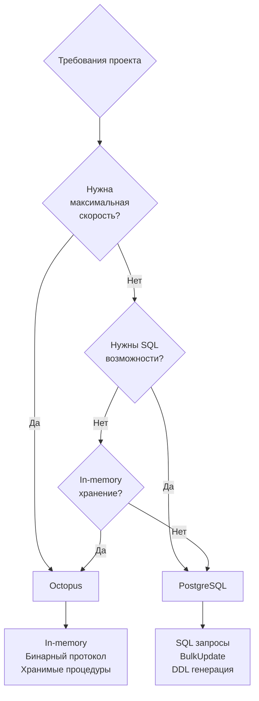

# Бэкенды

go-activerecord поддерживает два бэкенда: PostgreSQL и Octopus/Tarantool 1.5.

## Сравнение бэкендов

| Особенность | PostgreSQL | Octopus/Tarantool |
|-------------|------------|-------------------|
| Протокол | SQL (pgx/v5) | iproto (binary) |
| Namespace | Имя таблицы (`users`) | Числовой ID (`5`) |
| Условные индексы | ✅ Поддерживаются | ✅ Поддерживаются |
| Хранимые процедуры | ❌ Не реализовано | ✅ ProcFields |
| Порядок полей | Не важен | Критичен! |

!!! info "Автокоммит"
    Оба бэкенда работают в режиме **автокоммита**. Транзакции не поддерживаются. Подробнее: [Транзакции и автокоммит](transactions.md).

## PostgreSQL

### Декларация

```go
//ar:serverConf:pgconf
//ar:namespace:users
//ar:backend:postgres
type FieldsUser struct {
    Id    int64  `ar:"primary_key"`
    Email string `ar:"unique;size:256"`
    Name  string `ar:"size:256"`
}
```

### Особенности

**Условные индексы:**

```go
type IndexesUser struct {
    ActiveUsers bool `ar:"fields:Status,CreatedAt;condition:Status[=]1&&DeletedAt[is null]"`
}
```

**BulkUpdate и BulkInsertReplace:**

```go
// Массовое обновление
updatedCount, err := user.BulkUpdate(ctx, users)

// Массовая вставка
err := user.BulkInsertReplace(ctx, users, user.OnConflictEmail)
```

**Генерация DDL схемы:**

```bash
argen --path "model/repository" --schema-output schema.sql
```

### Драйвер

Используется [pgx/v5](https://github.com/jackc/pgx) — высокопроизводительный драйвер PostgreSQL для Go.

## Octopus/Tarantool 1.5

### Декларация

```go
//ar:serverConf:octconf
//ar:namespace:5
//ar:backend:octopus
type FieldsUser struct {
    Id    int64  `ar:"primary_key"`
    Email string `ar:"size:256;selector:SelectByEmail"`
    Name  string `ar:"size:256"`
}
```

### Особенности

!!! danger "Порядок полей критичен"
    Порядок полей в `Fields*` должен **точно** соответствовать порядку полей в tuple. Несоответствие приведёт к повреждению данных!

**Протокол iproto:**

Используется бинарный протокол [iproto](https://github.com/Vespertinus/octopus/blob/master/doc/silverbox-protocol.txt) для максимальной производительности.

**Дополнительные поля (extraFields):**

Если tuple содержит больше полей, чем объявлено, лишние сохраняются в `extraFields`.

**Триггер RepairTuple:**

```go
type TriggersFoo struct {
    RepairTuple bool `ar:"pkg:github.com/myapp/repair;func:RepairTuple"`
}
```

Вызывается при проблемах с десериализацией (например, неверное число полей).

### Порядок индексов

Порядок объявления индексов должен соответствовать конфигурации Octopus:

```go
type IndexesUser struct {
    // Индекс 0
    Primary bool `ar:"fields:Id;primary_key"`
    // Индекс 1
    Email bool `ar:"fields:Email;unique"`
    // Индекс 2
    Status bool `ar:"fields:Status"`
}
```

## Выбор бэкенда



### Когда PostgreSQL

- Сложные SQL-запросы и аналитика
- BulkUpdate/BulkInsertReplace для массовых операций
- Генерация DDL схемы
- Интеграция с существующей PostgreSQL инфраструктурой

### Когда Octopus

- Требуется максимальная производительность (in-memory)
- Минимальная задержка операций
- Хранимые процедуры на Lua (ProcFields)
- Существующая инфраструктура на Tarantool 1.5

## Миграция между бэкендами

Для миграции с Octopus на PostgreSQL:

1. Измените `//ar:backend:postgres`
2. Измените namespace с числа на имя таблицы
3. Перегенерируйте код
4. Создайте таблицу в PostgreSQL

```go
// Было
//ar:namespace:5
//ar:backend:octopus

// Стало
//ar:namespace:users
//ar:backend:postgres
```

!!! tip "Совет"
    Используйте [генератор схемы](../postgresql/schema-generator.md) для создания DDL из декларации.

## Следующие шаги

- [PostgreSQL](../postgresql/index.md) — специфические возможности
- [Octopus](../octopus/index.md) — работа с tuples и процедурами
