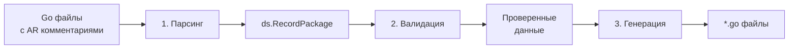

# Генерация кода

Процесс генерации кода состоит из трёх фаз: парсинг, валидация и генерация.

## Три фазы генерации



### Фаза 1: Парсинг

**Путь:** `internal/pkg/parser/`

Парсер читает Go файлы и извлекает:

- **AR комментарии** (`//ar:...`) — метаданные модели
- **Struct теги** (`ar:"..."`) — атрибуты полей
- **Типы структур** — Fields*, Indexes*, Serializers* и др.

```go
// Входные данные (декларация)
//ar:serverConf:mydb
//ar:namespace:users
//ar:backend:postgres
type FieldsUser struct {
    Id    int64  `ar:"primary_key"`
    Email string `ar:"unique;size:256"`
}

// Результат парсинга
ds.RecordPackage{
    Namespace: {PublicName: "users", ObjectName: "users"},
    Server: {Timeout: "...", PoolSize: 10},
    Fields: []FieldDeclaration{
        {Name: "Id", Format: "int64", PrimaryKey: true},
        {Name: "Email", Format: "string", Size: 256, Unique: true},
    },
}
```

### Фаза 2: Валидация

**Путь:** `internal/pkg/checker/`

Валидатор проверяет:

| Проверка | Описание |
|----------|----------|
| Primary key | Ровно один PK должен быть объявлен |
| Индексы | Все поля индекса существуют |
| Сериализаторы | Типы совместимы |
| Имена пакетов | Regex `^[a-z]{1,20}$` |
| Порядок полей | Для Octopus — соответствие tuple |

!!! warning "Важно для Octopus"
    Порядок полей в `Fields*` должен **точно** соответствовать порядку в tuple базы данных.

### Фаза 3: Генерация

**Путь:** `internal/pkg/generator/`

Генератор использует Go templates для создания кода:

```
internal/pkg/backend/postgres/tmpl/
├── pkg/
│   ├── main.tmpl         # Основная структура и методы
│   ├── select.tmpl       # Селекторы
│   ├── mutator.tmpl      # Мутаторы
│   └── ...
└── fixture/
    └── ...               # Шаблоны для тестовых фикстур
```

## Структура сгенерированного кода

Для каждой модели генерируется пакет с:

### Структура данных

```go
type User struct {
    // Системные поля
    activerecord.BaseField
    Exists    bool
    IsReplica bool
    Readonly  bool
    Repaired  bool

    // Поля из декларации
    id    int64
    email string
    name  string
}
```

### CRUD методы

```go
func (u *User) Insert(ctx context.Context) error
func (u *User) Update(ctx context.Context) error
func (u *User) Replace(ctx context.Context) error
func (u *User) InsertOrReplace(ctx context.Context) error
func (u *User) Delete(ctx context.Context) error
```

### Аксессоры

```go
func (u *User) GetId() int64
func (u *User) SetId(v int64)    // Защищён для PK!
func (u *User) GetEmail() string
func (u *User) SetEmail(v string)
```

### Селекторы

```go
// По одному ключу
func SelectById(ctx context.Context, id int64) (*User, error)
func SelectByEmail(ctx context.Context, email string) (*User, error)

// По набору ключей
func SelectByIds(ctx context.Context, ids []int64) ([]*User, error)
func SelectByEmails(ctx context.Context, emails []string) ([]*User, error)
```

### Мутаторы

```go
func (u *User) IncCounter(delta uint32)
func (u *User) DecCounter(delta uint32)
func (u *User) SetBitFlags(mask uint32)
func (u *User) ClearBitFlags(mask uint32)
```

## Маркер-файл .argen

В папке назначения создаётся файл `.argen`:

```
model/repository/generated/
├── .argen      # Маркер-файл
├── user/
└── product/
```

!!! warning "Не удаляйте .argen"
    Этот файл защищает от случайной генерации в неправильную директорию. При его отсутствии argen откажется генерировать код.

## Инкрементальная генерация

При каждом запуске argen:

1. Проверяет наличие `.argen`
2. **Удаляет все `.go` файлы** в папке назначения
3. Генерирует код заново

!!! danger "Никогда не редактируйте сгенерированный код"
    Все изменения будут потеряны при следующей генерации.

## Следующие шаги

- [Бэкенды](backends.md) — особенности PostgreSQL и Octopus
- [Шаблоны](../development/templates.md) — модификация шаблонов генерации
