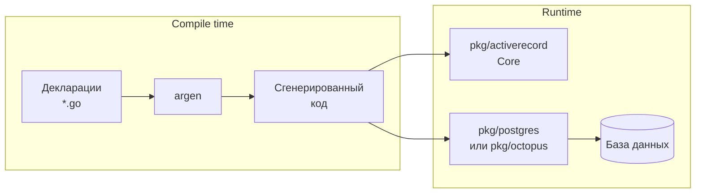
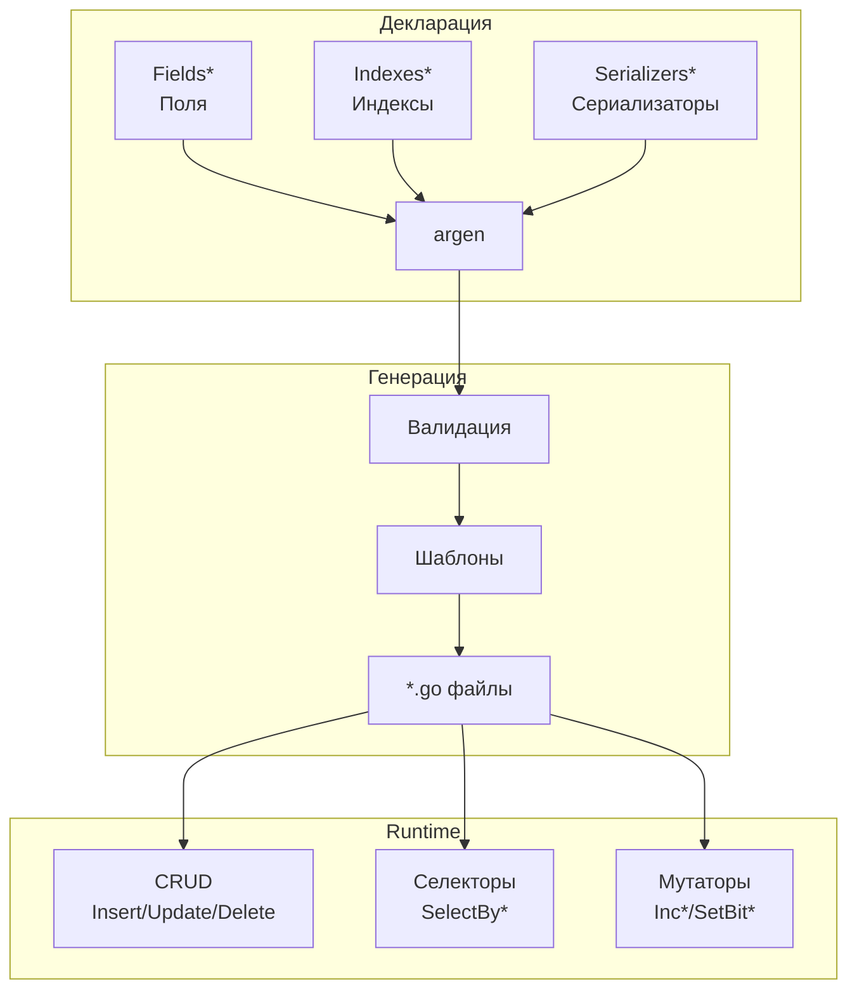

# Архитектура

Обзор архитектуры go-activerecord и принципов работы генератора кода.

## Содержание раздела

- [Генерация кода](code-generation.md) — 3-фазный процесс генерации
- [Бэкенды](backends.md) — сравнение PostgreSQL и Octopus
- [Транзакции и автокоммит](transactions.md) — почему нет транзакций

## Псевдо-Active Record

go-activerecord реализует **модифицированный** паттерн Active Record с важным отличием от классической реализации.

### Классический Active Record

В классическом паттерне (Ruby on Rails, Eloquent) каждое изменение поля **автоматически** синхронизируется с БД:

```ruby
# Ruby on Rails — запись в БД при каждом изменении
user.name = "John"  # → UPDATE users SET name='John' WHERE id=1
user.email = "j@x.com"  # → UPDATE users SET email='j@x.com' WHERE id=1
```

### go-activerecord

В go-activerecord изменения **накапливаются** в памяти и отправляются в БД **одним запросом** при явном вызове `Update()`:

```go
// Изменения накапливаются в памяти
user.SetName("John")       // Только в памяти
user.SetEmail("j@x.com")   // Только в памяти
user.IncLoginCount(1)      // Только в памяти

// Один запрос к БД со всеми изменениями
user.Update(ctx)  // → UPDATE users SET name='John', email='j@x.com', login_count=login_count+1 WHERE id=1
```

### Сравнение подходов

| Аспект | Классический AR | go-activerecord |
|--------|----------------|-----------------|
| Запись в БД | При каждом Set | При вызове Update() |
| Количество запросов | N (по числу изменений) | 1 |
| Контроль транзакций | Неявный | Явный |
| Атомарность | Нет | Да (один UPDATE) |
| Накладные расходы | Высокие | Низкие |
| Явность | Неявная запись | Явная запись |

### Почему всё же Active Record?

Несмотря на отличие в механизме персистенции, go-activerecord сохраняет **ключевые принципы** паттерна Active Record:

| Принцип Active Record | Реализация в go-activerecord |
|----------------------|------------------------------|
| **Объект = строка таблицы** | Структура `User` соответствует записи в таблице `users` |
| **Поля объекта = колонки** | `user.GetEmail()` → колонка `email` |
| **Объект знает о БД** | Методы `Insert()`, `Update()`, `Delete()` встроены в объект |
| **CRUD в объекте** | `user.Insert(ctx)`, `user.Update(ctx)`, `user.Delete(ctx)` |
| **Селекторы как статические методы** | `user.SelectById(ctx, 123)` |

```go
// Классическая структура Active Record
user := user.New(ctx)           // Новая запись
user.SetName("John")            // Поле = колонка
user.Insert(ctx)                // Объект сам себя сохраняет

found, _ := user.SelectById(ctx, 1)  // Статический finder
found.SetName("Jane")           // Изменение поля
found.Update(ctx)               // Объект сам себя обновляет
found.Delete(ctx)               // Объект сам себя удаляет
```

### Отличие: явная персистенция

Единственное отличие — **момент записи в БД**:

- **Классический AR**: неявно при изменении поля
- **go-activerecord**: явно при вызове `Update()`

Это осознанный компромисс ради производительности и атомарности.

### Почему такой выбор?

1. **Производительность** — один запрос вместо N
2. **Атомарность** — все изменения применяются вместе
3. **Контроль** — разработчик явно решает, когда писать в БД
4. **Мутаторы** — атомарные операции (inc, dec, set_bit) невозможны при автосохранении
5. **Предсказуемость** — нет неожиданных запросов к БД

!!! info "Гибридный подход"
    go-activerecord сочетает **структуру Active Record** (объект = запись, CRUD в объекте) с **механизмом Unit of Work** (накопление изменений, явный flush). Это даёт лучшее из обоих миров: интуитивный API и высокую производительность.

## Обзор

go-activerecord — это генератор кода, реализующий модифицированный паттерн Active Record. В отличие от ORM с reflection, весь код генерируется на этапе сборки.



## Компоненты системы

### Генератор (argen)

| Компонент | Путь | Описание |
|-----------|------|----------|
| CLI | `cmd/argen/` | Точка входа командной строки |
| Парсер | `internal/pkg/parser/` | Чтение Go файлов и AR комментариев |
| Валидатор | `internal/pkg/checker/` | Проверка корректности деклараций |
| Генератор | `internal/pkg/generator/` | Генерация кода из шаблонов |
| Бэкенды | `internal/pkg/backend/` | Специфичная логика для каждой БД |

### Runtime библиотеки

| Пакет | Описание |
|-------|----------|
| `pkg/activerecord` | Ядро: интерфейсы, пул соединений, кластеры |
| `pkg/postgres` | Реализация для PostgreSQL (pgx/v5) |
| `pkg/octopus` | Реализация для Octopus/Tarantool 1.5 |
| `pkg/iproto` | Протокол iproto для Octopus |
| `pkg/serializer` | Встроенные сериализаторы |
| `pkg/logger` | Абстракции логирования |

## Поток данных



## Принципы проектирования

### 1. Zero-reflection

Весь код генерируется на этапе компиляции. Нет reflection в runtime → максимальная производительность.

### 2. Type safety

Типы проверяются компилятором Go. Ошибки обнаруживаются при сборке, а не в production.

### 3. Convention over configuration

Разумные значения по умолчанию. Минимум обязательных настроек для начала работы.

### 4. Backend agnostic

Единый API для разных баз данных. Смена бэкенда требует минимальных изменений в декларации.

!!! tip "Совет"
    Изучите раздел [Генерация кода](code-generation.md) для понимания 3-фазного процесса.

## Следующие шаги

- [Генерация кода](code-generation.md) — детали процесса генерации
- [Бэкенды](backends.md) — выбор между PostgreSQL и Octopus
- [Транзакции и автокоммит](transactions.md) — почему нет транзакций и как с этим жить
- [Декларации](../declaration/index.md) — синтаксис описания моделей
