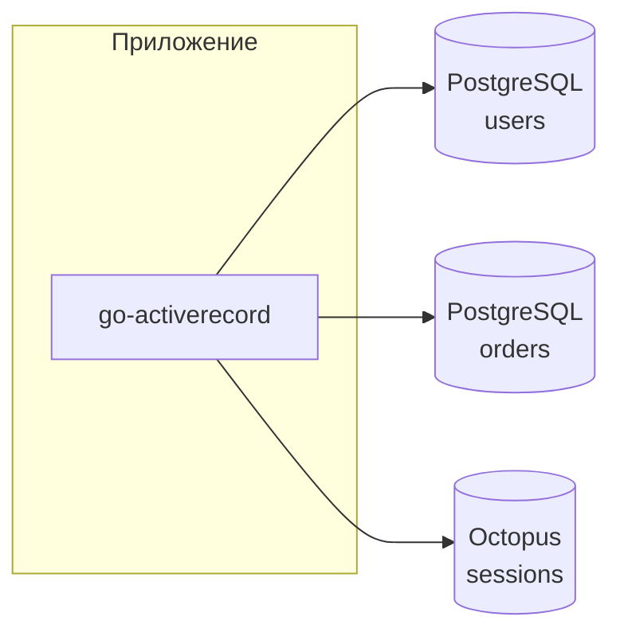
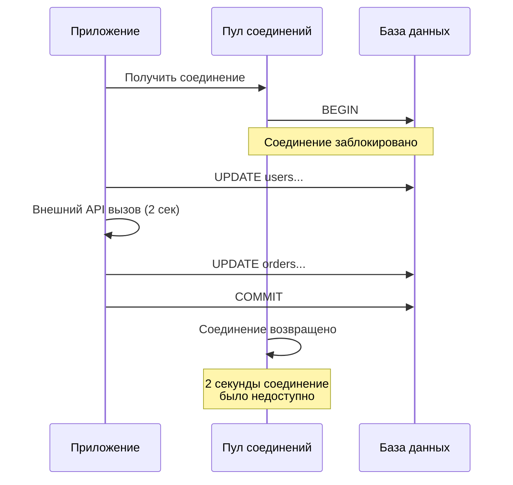
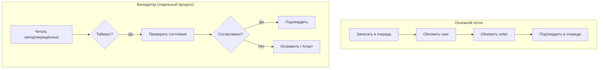
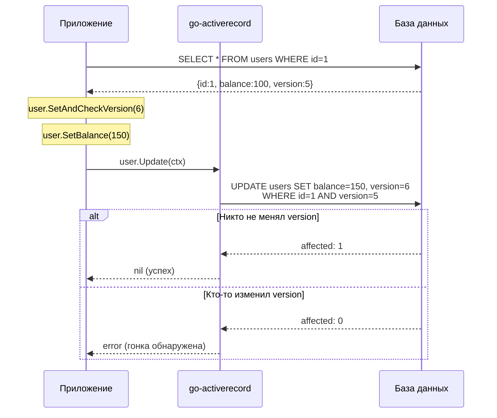

# Транзакции и автокоммит

go-activerecord **не поддерживает транзакции**. Все операции выполняются в режиме автокоммита.

## Почему нет транзакций

### Распределённые данные

ORM проектировался для работы с данными, распределёнными по **нескольким базам данных**:



Транзакция в рамках одной БД **не решает проблему** согласованности между разными БД:

```go
// Псевдокод: что могло бы быть с транзакциями
tx1 := usersDB.Begin()
tx2 := ordersDB.Begin()

user.SetBalance(100)
user.Update(ctx)  // tx1

order.SetStatus("paid")
order.Update(ctx)  // tx2

tx1.Commit()  // ✅ Успех
tx2.Commit()  // ❌ Ошибка — user уже обновлён, order нет
```

!!! danger "Ложное чувство безопасности"
    Транзакции в рамках одной БД создают **иллюзию согласованности**, но не защищают от рассинхрона между разными хранилищами.

### Заблокированные соединения

Открытая транзакция **удерживает соединение** из пула на всё время своего существования:



**Проблемы:**

| Проблема | Последствие |
|----------|-------------|
| Долгие транзакции | Исчерпание пула соединений |
| Забытый Rollback | Утечка соединений |
| Deadlock в БД | Каскадные таймауты |
| Высокая нагрузка | Все соединения заняты транзакциями |

!!! warning "Octopus/Tarantool"
    In-memory БД особенно чувствительны к долгим транзакциям — они блокируют не только соединение, но и могут блокировать другие операции из-за однопоточной модели.

## Архитектурный подход

### Автокоммит по умолчанию

Каждая операция — отдельный автокоммит:

```go
user.SetName("Alice")
user.Update(ctx)  // Автокоммит

order.SetStatus("paid")
order.Update(ctx)  // Автокоммит
```

### Мутаторы vs Идемпотентность

go-activerecord предоставляет два подхода к обновлению данных:

#### Мутаторы — атомарные операции

Мутаторы (`Inc`, `Dec`, `SetBit`, `ClearBit`) выполняются **атомарно на уровне БД**:

```go
// Атомарный инкремент — безопасен при конкурентных запросах
user.IncBalance(100)
user.IncLoginCount(1)
user.Update(ctx)
// → UPDATE users SET balance = balance + 100, login_count = login_count + 1 WHERE id = ?
```

**Когда использовать мутаторы:**

| Сценарий | Пример |
|----------|--------|
| Счётчики | `IncViewCount(1)`, `IncLoginCount(1)` |
| Балансы с конкурентным доступом | `IncBalance(100)`, `DecBalance(50)` |
| Битовые флаги | `SetBitFlags(FlagPremium)`, `ClearBitFlags(FlagBanned)` |
| Рейтинги | `IncRating(1)`, `DecRating(1)` |

```go
// Конкурентное обновление счётчика — мутатор безопасен
// Горутина 1:
user.IncViewCount(1)  // → view_count = view_count + 1

// Горутина 2 (параллельно):
user.IncViewCount(1)  // → view_count = view_count + 1

// Результат: view_count увеличился на 2 (корректно)
```

#### Идемпотентные операции — для повторных запросов

Идемпотентность нужна когда операция может быть **повторена** (retry, сбой сети, дубликат сообщения):

```go
// Обработка платежа — должна быть идемпотентной
func ProcessPayment(ctx context.Context, paymentId string, amount int64) error {
    // Проверка дубликата
    existing, err := payment.SelectByExternalId(ctx, paymentId)
    if err == nil {
        return nil  // Уже обработан
    }

    user, _ := user.SelectById(ctx, userId)
    user.SetBalance(user.GetBalance() + amount)  // Идемпотентно с проверкой выше
    user.Update(ctx)

    p := payment.New(ctx)
    p.SetExternalId(paymentId)  // Уникальный ключ для дедупликации
    p.SetAmount(amount)
    return p.Insert(ctx)
}
```

**Когда нужна идемпотентность:**

| Сценарий | Решение |
|----------|---------|
| Webhook от платёжной системы | Уникальный `external_id` |
| Обработка сообщений из очереди | `idempotency_key` |
| Retry после таймаута | Проверка существующей записи |

!!! tip "Комбинируйте подходы"
    Мутаторы и идемпотентность не исключают друг друга. Используйте мутаторы для атомарности, а идемпотентность — для защиты от дубликатов.

### Валидация согласованности

При изменении данных в нескольких БД сначала **записывайте намерение**, потом выполняйте:



**Порядок важен:**

1. **Сначала очередь** — записываем намерение (что собираемся сделать)
2. **Потом изменения** — выполняем операции в БД
3. **Подтверждение** — помечаем операцию как завершённую

Если процесс упал между шагами 2 и 3, валидатор обнаружит неподтверждённую запись и проверит фактическое состояние.

```go
// Запись намерения ПЕРЕД изменениями
func TransferBalance(ctx context.Context, fromId, toId, amount int64) error {
    // 1. Записываем намерение
    op := operation.New(ctx)
    op.SetType("transfer")
    op.SetFromUserId(fromId)
    op.SetToUserId(toId)
    op.SetAmount(amount)
    op.SetStatus("pending")
    if err := op.Insert(ctx); err != nil {
        return err
    }

    // 2. Выполняем изменения
    from, _ := user.SelectById(ctx, fromId)
    from.IncBalance(-amount)
    if err := from.Update(ctx); err != nil {
        return err  // Валидатор увидит pending операцию
    }

    to, _ := user.SelectById(ctx, toId)
    to.IncBalance(amount)
    if err := to.Update(ctx); err != nil {
        return err  // Валидатор увидит частично выполненную операцию
    }

    // 3. Подтверждаем
    op.SetStatus("completed")
    return op.Update(ctx)
}
```

### Компенсирующие транзакции (Saga)

Для сложных операций используйте паттерн Saga:

```go
func CreateOrderSaga(ctx context.Context, userId int64, amount int64) error {
    // Шаг 1: Резервируем баланс
    user, err := user.SelectById(ctx, userId)
    if err != nil {
        return err
    }

    user.SetReservedBalance(user.GetReservedBalance() + amount)
    if err := user.Update(ctx); err != nil {
        return err
    }

    // Шаг 2: Создаём заказ
    order := order.New(ctx)
    order.SetUserId(userId)
    order.SetAmount(amount)
    order.SetStatus("pending")

    if err := order.Insert(ctx); err != nil {
        // Компенсация: откатываем резерв
        user.SetReservedBalance(user.GetReservedBalance() - amount)
        user.Update(ctx)
        return err
    }

    // Шаг 3: Подтверждаем
    user.SetBalance(user.GetBalance() - amount)
    user.SetReservedBalance(user.GetReservedBalance() - amount)
    if err := user.Update(ctx); err != nil {
        // Компенсация: отменяем заказ
        order.SetStatus("cancelled")
        order.Update(ctx)
        return err
    }

    order.SetStatus("confirmed")
    return order.Update(ctx)
}
```

### Оптимистичная блокировка (SetAndCheck)

go-activerecord предоставляет методы `SetAndCheck*` для обнаружения гонок **без блокировок на уровне БД**.

#### Как это работает



`SetAndCheck*` запоминает **текущее значение** поля и добавляет его в WHERE при Update:

```go
user, _ := user.SelectById(ctx, 123)
// user.GetVersion() == 5

// SetAndCheck запоминает текущее значение (5) и устанавливает новое (6)
user.SetAndCheckVersion(user.GetVersion() + 1)
user.SetBalance(150)

err := user.Update(ctx)
// SQL: UPDATE users SET balance=150, version=6 WHERE id=123 AND version=5

if err != nil {
    // Гонка! Кто-то изменил version между SELECT и UPDATE
    // Нужно перечитать и повторить
}
```

#### Преимущества перед блокировками

| Аспект | Пессимистичная блокировка (SELECT FOR UPDATE) | Оптимистичная (SetAndCheck) |
|--------|----------------------------------------------|----------------------------|
| Блокировка соединения | Да, на всё время транзакции | Нет |
| Deadlock | Возможен | Невозможен |
| Производительность | Низкая при конкуренции | Высокая |
| Retry при конфликте | Не нужен | Нужен |
| Подходит для | Редкие конфликты, критичные данные | Частые чтения, редкие записи |

!!! tip "Без deadlock"
    `SetAndCheck` не захватывает блокировки в БД, поэтому **deadlock невозможен**. При обнаружении гонки вы просто перечитываете данные и повторяете операцию.

#### Пример: безопасное обновление баланса

```go
func UpdateBalanceWithRetry(ctx context.Context, userId int64, delta int64) error {
    maxRetries := 3

    for i := 0; i < maxRetries; i++ {
        user, err := user.SelectById(ctx, userId)
        if err != nil {
            return err
        }

        // Проверяем version при Update
        if err := user.SetAndCheckVersion(user.GetVersion() + 1); err != nil {
            return err
        }

        user.SetBalance(user.GetBalance() + delta)

        err = user.Update(ctx)
        if err == nil {
            return nil  // Успех
        }

        // Гонка — повторяем
        log.Printf("Race detected, retry %d/%d", i+1, maxRetries)
    }

    return fmt.Errorf("failed after %d retries", maxRetries)
}
```

#### Когда использовать SetAndCheck

| Сценарий | Рекомендация |
|----------|--------------|
| Обновление баланса с проверкой | `SetAndCheckVersion` |
| Изменение статуса (только из определённого) | `SetAndCheckStatus` |
| Редактирование профиля | `SetAndCheckUpdatedAt` |
| Конкурентное изменение настроек | `SetAndCheckVersion` |

```go
// Изменение статуса только если он "pending"
order, _ := order.SelectById(ctx, orderId)

if order.GetStatus() != "pending" {
    return fmt.Errorf("order is not pending")
}

// SetAndCheck гарантирует, что статус всё ещё "pending" в момент UPDATE
order.SetAndCheckStatus("processing")

if err := order.Update(ctx); err != nil {
    // Кто-то уже изменил статус
    return fmt.Errorf("order status changed concurrently")
}
```

#### Ограничения

- Можно вызвать `SetAndCheck*` для поля **только один раз** (повторный вызов вернёт ошибку)
- Нельзя комбинировать `SetAndCheck*` и `Set*` для одного поля
- При гонке нужно реализовать retry логику

## Когда нужны транзакции

Если транзакции **действительно необходимы** (данные в одной БД, критичная согласованность), используйте драйвер напрямую:

### PostgreSQL (pgx)

```go
import "github.com/jackc/pgx/v5"

func WithTransaction(ctx context.Context, db *pgx.Conn, fn func(tx pgx.Tx) error) error {
    tx, err := db.Begin(ctx)
    if err != nil {
        return err
    }
    defer tx.Rollback(ctx)

    if err := fn(tx); err != nil {
        return err
    }

    return tx.Commit(ctx)
}
```

!!! warning "Вне go-activerecord"
    При использовании транзакций напрямую через драйвер, вы **обходите** go-activerecord. Объекты AR не знают о транзакции и работают через свои соединения.

## Best Practices

### 1. Минимизируйте окно несогласованности

```go
// ❌ Плохо: долгое окно несогласованности
user.SetStatus("processing")
user.Update(ctx)

result := callExternalAPI()  // 2 секунды

user.SetStatus(result.Status)
user.Update(ctx)

// ✅ Хорошо: атомарное обновление
result := callExternalAPI()

user.SetStatus(result.Status)
user.SetProcessedAt(time.Now().Unix())
user.Update(ctx)
```

### 2. Используйте статусы и timestamps

```go
type FieldsOrder struct {
    Id          int64  `ar:"primary_key;init_by_db"`
    Status      string `ar:"size:32"`           // pending → processing → done
    ProcessedAt int64  `ar:""`                  // Когда обработан
    IdempotencyKey string `ar:"unique;size:64"` // Для дедупликации
}
```

### 3. Логируйте для аудита

```go
user.SetBalance(newBalance)
if err := user.Update(ctx); err != nil {
    return err
}

// Лог для восстановления
log.Info("Balance updated",
    "user_id", user.GetId(),
    "old_balance", oldBalance,
    "new_balance", newBalance,
    "operation_id", operationId,
)
```

### 4. Eventual Consistency

Примите, что данные **в конечном итоге** станут согласованными:

```go
// Очередь на обработку
queue.Push(Event{
    Type:   "balance_changed",
    UserId: user.GetId(),
    Amount: amount,
})

// Воркер обрабатывает и валидирует
func ProcessEvents(ctx context.Context) {
    for event := range queue.Consume() {
        validateAndFix(ctx, event)
    }
}
```

## Следующие шаги

- [CRUD операции](../usage/crud.md) — базовые операции
- [BulkUpdate](../postgresql/bulk-update.md) — особенности массового обновления
- [Бэкенды](backends.md) — сравнение PostgreSQL и Octopus
