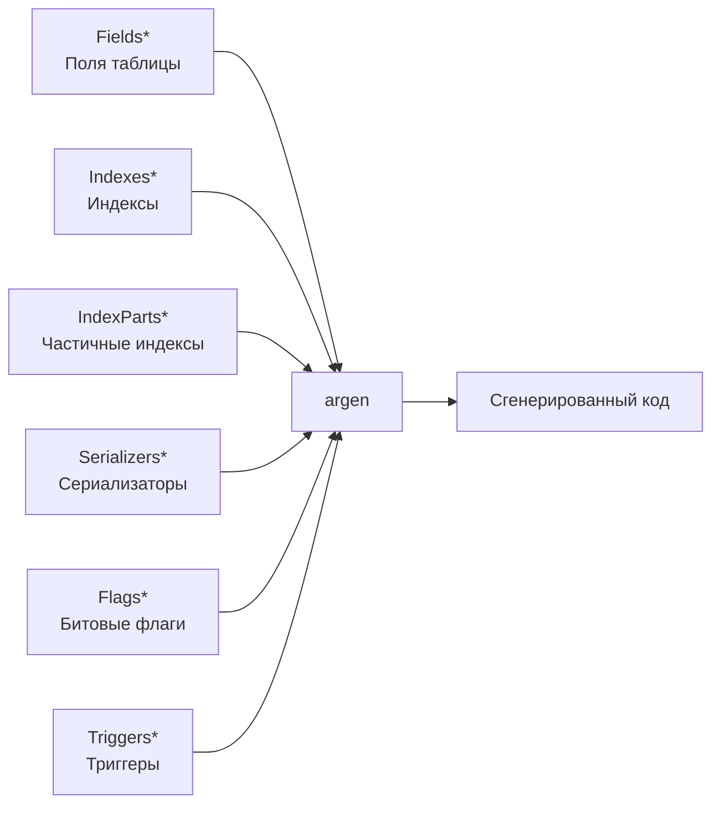

# Декларации

Декларативное описание моделей — основа go-activerecord. Модели описываются с помощью специальных комментариев и структур.

## Содержание раздела

- [Поля (Fields)](fields.md) — основная структура Fields* и теги полей
- [Индексы](indexes.md) — Indexes* и IndexParts*
- [Сериализаторы](serializers.md) — Serializers* и встроенные сериализаторы
- [Мутаторы и флаги](mutators.md) — Mutators* и Flags*
- [Триггеры](triggers.md) — Triggers* для обработки исключений
- [Связи и процедуры](relations.md) — FieldsObject* и ProcFields*

## Обзор

Модель описывается набором структур с префиксами:



| Структура | Назначение |
|-----------|------------|
| `Fields*` | Поля таблицы/спейса |
| `Indexes*` | Составные индексы |
| `IndexParts*` | Частичные селекторы |
| `Serializers*` | Сериализация полей |
| `Mutators*` | Пользовательские мутаторы |
| `Flags*` | Именованные битовые флаги |
| `Triggers*` | Обработка исключений |
| `FieldsObject*` | Связи между моделями |
| `ProcFields*` | Хранимые процедуры |

## Минимальный пример

```go
package repository

//ar:serverConf:mydb
//ar:namespace:users
//ar:backend:postgres
type FieldsUser struct {
    Id   int64  `ar:"primary_key"`
    Name string `ar:"size:256"`
}
```

## AR комментарии

Комментарии начинаются с `//ar:` и описывают метаданные модели:

```go
//ar:serverConf:mydb          // Ключ конфигурации
//ar:namespace:users          // Имя таблицы (PG) или номер спейса (Octopus)
//ar:backend:postgres         // Тип бэкенда
//ar:enableSelectAll:10000    // Разрешить SelectAll с лимитом
```

| Комментарий | Описание |
|-------------|----------|
| `serverConf` | Ключ в конфигурации для параметров подключения |
| `namespace` | Имя таблицы (PostgreSQL) или номер спейса (Octopus) |
| `backend` | Тип БД: `postgres` или `octopus` |
| `enableSelectAll` | Генерация SelectAll с указанным лимитом (макс. 20000) |

!!! tip "Совет"
    Комментарии можно группировать через `;`:
    ```go
    //ar:serverConf:mydb;namespace:users;backend:postgres
    ```

## Именование

- **Имя пакета:** regex `^[a-z]{1,20}$` (только строчные, макс. 20 символов)
- **Имя структуры:** `Fields{ModelName}`, `Indexes{ModelName}` и т.д.
- **ModelName:** определяет имя генерируемого пакета

!!! warning "Важно"
    Имя пакета в декларации должно быть `repository`.

## Следующие шаги

- [Поля (Fields)](fields.md) — начните с описания полей
- [Справочник тегов](../reference/tags.md) — все доступные теги
