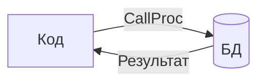

# Связи и процедуры

Структуры `FieldsObject*` и `ProcFields*` описывают связи между моделями и хранимые процедуры.

## FieldsObject* — Связи между моделями

### Обзор

`FieldsObject*` позволяет автоматически загружать связанные объекты:

```mermaid
graph LR
    A[Order] -->|GetUser()| B[User]
    A -->|GetProduct()| C[Product]
```

### Объявление

```go
// Модель заказа
type FieldsOrder struct {
    Id        int64  `ar:"primary_key"`
    UserId    int64  `ar:""`
    ProductId int64  `ar:""`
    Quantity  uint32 `ar:""`
}

type FieldsObjectOrder struct {
    User    int64 `ar:"key:Id;object:User;field:UserId"`
    Product int64 `ar:"key:Id;object:Product;field:ProductId"`
}
```

### Теги FieldsObject*

| Тег | Описание | Пример |
|-----|----------|--------|
| `key` | Поле в связанном объекте | `key:Id` |
| `object` | Имя связанной модели | `object:User` |
| `field` | Поле в текущем объекте | `field:UserId` |
| `shard_by` | Функция определения шарда | `shard_by:*` |

### Генерируемые методы

```go
// Получение связанного объекта
user, err := order.GetUser(ctx)
if err != nil {
    return err
}

product, err := order.GetProduct(ctx)
```

### Ленивая загрузка

Связанные объекты загружаются **лениво** — только при вызове геттера:

```go
order, _ := order.SelectById(ctx, 123)

// Первый вызов — запрос к БД
user1, _ := order.GetUser(ctx)

// Повторный вызов — может использовать кэш
user2, _ := order.GetUser(ctx)
```

### Шардирование

Для поиска по всем шардам используйте `shard_by:*`:

```go
type FieldsObjectOrder struct {
    User int64 `ar:"key:Id;object:User;field:UserId;shard_by:*"`
}
```

!!! note "Не реализовано"
    Функция определения шарда через `shard_by` в текущей версии не полностью реализована.

## ProcFields* — Хранимые процедуры

### Обзор

`ProcFields*` позволяет вызывать хранимые процедуры/функции БД:



### Объявление

```go
//ar:serverConf:octconf
//ar:namespace:calculate_stats  // Имя процедуры
//ar:backend:octopus
type ProcFieldsStats struct {
    // Входные параметры
    UserId    string `ar:"input;size:32"`
    StartDate string `ar:"input;size:10"`
    EndDate   string `ar:"input;size:10"`

    // Выходные параметры
    TotalOrders uint32 `ar:"output"`
    TotalAmount int64  `ar:"output"`
    AvgAmount   int64  `ar:"output"`
}
```

### Теги ProcFields*

| Тег | Описание | Пример |
|-----|----------|--------|
| `input` | Входной параметр | `input` |
| `output` | Выходной параметр | `output` |
| `output:N` | Выходной параметр с порядковым номером | `output:2` |
| `serializer` | Сериализатор для параметра | `serializer:Json` |
| `size` | Размер параметра | `size:256` |

### Порядок параметров

Порядок объявления полей должен соответствовать сигнатуре процедуры:

```go
type ProcFieldsMyProc struct {
    // Входные параметры в порядке сигнатуры
    Param1 string `ar:"input"`
    Param2 string `ar:"input"`

    // Выходные параметры в порядке возврата
    Result1 int64  `ar:"output"`
    Result2 string `ar:"output"`
}
```

### Использование

```go
// Создание объекта для вызова
stats := stats.New(ctx)

// Установка входных параметров
stats.SetUserId("123")
stats.SetStartDate("2024-01-01")
stats.SetEndDate("2024-12-31")

// Вызов процедуры
if err := stats.Call(ctx); err != nil {
    return err
}

// Чтение результатов
fmt.Printf("Total orders: %d\n", stats.GetTotalOrders())
fmt.Printf("Total amount: %d\n", stats.GetTotalAmount())
```

## Octopus: особенности ProcFields*

### Типы входных параметров

Для Octopus входные параметры могут быть только строкового типа:

```go
type ProcFieldsOctopus struct {
    // Только string или []byte
    UserId string `ar:"input;size:32"`
    Data   []byte `ar:"input;size:1024"`

    // Для сложных типов — сериализатор
    Params string `ar:"input;serializer:Json;size:2048"`
}
```

### Сериализаторы для входных параметров

```go
type ProcFieldsOctopus struct {
    // Список строк через сериализатор
    Tags []string `ar:"input;serializer:StringList"`
}

type SerializersOctopus struct {
    Tags []string `ar:"pkg:github.com/myapp/serializers;object:TagsS"`
}
```

Сериализатор должен возвращать `string` или `[]string`:

```go
func TagsSMarshal(tags []string) ([]string, error) {
    return tags, nil  // Каждый элемент станет отдельным параметром
}
```

### Выходные параметры

Выходные параметры соответствуют полям tuple:

```go
type ProcFieldsOctopus struct {
    Input1 string `ar:"input"`

    // Порядок output полей = порядок в tuple результата
    Field1 int64  `ar:"output"`  // tuple[0]
    Field2 string `ar:"output"`  // tuple[1]
    Field3 uint32 `ar:"output"`  // tuple[2]
}
```

## Полный пример

```go
// model/repository/declaration/order.go
package repository

//ar:serverConf:pgconf
//ar:namespace:orders
//ar:backend:postgres
type FieldsOrder struct {
    Id        int64  `ar:"primary_key;init_by_db"`
    UserId    int64  `ar:""`
    ProductId int64  `ar:""`
    Quantity  uint32 `ar:""`
    Status    string `ar:"size:32"`
    CreatedAt uint32 `ar:""`
}

// Связи с другими моделями
type FieldsObjectOrder struct {
    User    int64 `ar:"key:Id;object:User;field:UserId"`
    Product int64 `ar:"key:Id;object:Product;field:ProductId"`
}

type IndexesOrder struct {
    UserCreated bool `ar:"fields:UserId,CreatedAt;order:CreatedAt desc"`
}
```

```go
// model/repository/declaration/stats.go
package repository

//ar:serverConf:octconf
//ar:namespace:calculate_user_stats
//ar:backend:octopus
type ProcFieldsUserStats struct {
    // Входные параметры
    UserId    string `ar:"input;size:32"`
    StartDate string `ar:"input;size:10"`
    EndDate   string `ar:"input;size:10"`

    // Выходные параметры
    OrderCount   uint32 `ar:"output"`
    TotalAmount  int64  `ar:"output"`
    AverageOrder int64  `ar:"output"`
}
```

```go
// Использование
func GetOrderWithDetails(ctx context.Context, orderId int64) error {
    // Получаем заказ
    ord, err := order.SelectById(ctx, orderId)
    if err != nil {
        return err
    }

    // Получаем связанного пользователя
    user, err := ord.GetUser(ctx)
    if err != nil {
        return err
    }

    // Получаем товар
    product, err := ord.GetProduct(ctx)
    if err != nil {
        return err
    }

    fmt.Printf("Order #%d: %s bought %s\n",
        ord.GetId(),
        user.GetName(),
        product.GetName(),
    )

    return nil
}

func GetUserStats(ctx context.Context, userId string) error {
    stats := userstats.New(ctx)
    stats.SetUserId(userId)
    stats.SetStartDate("2024-01-01")
    stats.SetEndDate("2024-12-31")

    if err := stats.Call(ctx); err != nil {
        return err
    }

    fmt.Printf("User %s: %d orders, total %d\n",
        userId,
        stats.GetOrderCount(),
        stats.GetTotalAmount(),
    )

    return nil
}
```

## Ограничения

!!! warning "Циклические зависимости"
    Циклические зависимости между моделями через `FieldsObject*` приводят к некомпилируемому коду. Планируется добавить проверку на этапе парсинга.

!!! warning "Ссылка на себя"
    Ссылка модели на саму себя через `FieldsObject*` пока не поддерживается.

## Следующие шаги

- [Хранимые процедуры Octopus](../octopus/procedures.md) — детали ProcFields
- [CRUD операции](../usage/crud.md) — основные операции
