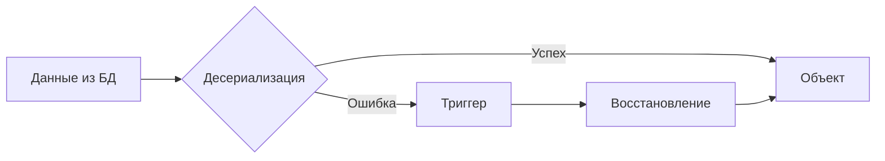

# Триггеры

Структура `Triggers*` описывает обработчики исключительных ситуаций при работе с данными.

## Обзор

Триггеры вызываются при проблемах с сериализацией/десериализацией или при ошибках работы с БД.



## Доступные триггеры

| Триггер | Описание | Бэкенд |
|---------|----------|--------|
| `RepairTuple` | Восстановление повреждённых tuple | Octopus |

## RepairTuple

### Назначение

Вызывается при проблемах с десериализацией tuple из Octopus:

- Неверное число полей в tuple
- Неверный формат поля
- Повреждённые данные

### Объявление

```go
type TriggersFoo struct {
    RepairTuple bool `ar:"pkg:github.com/myapp/repair;func:RepairTuple"`
}
```

### Теги

| Тег | Описание |
|-----|----------|
| `pkg` | Пакет с функцией-обработчиком |
| `func` | Имя функции-обработчика |

### Сигнатура функции

```go
package repair

import "github.com/Educentr/go-activerecord/v3/pkg/octopus"

func RepairTuple(tuple *octopus.TupleData) error {
    // Проверяем и восстанавливаем tuple
    return nil
}
```

### Структура TupleData

```go
type TupleData struct {
    Fields [][]byte  // Поля tuple
    // ...
}
```

### Пример реализации

```go
package repair

import (
    "github.com/Educentr/go-activerecord/v3/pkg/octopus"
)

// RepairTuple восстанавливает tuple с неверным числом полей
func RepairTuple(tuple *octopus.TupleData) error {
    expectedFields := 5

    // Если полей меньше ожидаемого — добавляем
    for len(tuple.Fields) < expectedFields {
        tuple.Fields = append(tuple.Fields, []byte(""))
    }

    // Если полей больше — обрезаем (опционально)
    if len(tuple.Fields) > expectedFields {
        tuple.Fields = tuple.Fields[:expectedFields]
    }

    return nil
}
```

### Флаг Repaired

После успешного восстановления объект помечается флагом `Repaired = true`:

```go
obj, err := foo.SelectById(ctx, 123)
if err != nil {
    return err
}

if obj.Repaired {
    // Tuple был восстановлен триггером
    // При Update() будет использоваться Replace вместо Update
    log.Println("Объект был восстановлен")
}
```

!!! note "Поведение Update"
    Если `Repaired = true`, то `Update()` работает как `Replace()` — перезаписывает все поля, а не только изменённые.

## Случаи использования

### Миграция схемы

При добавлении новых полей старые tuple могут не иметь этих полей:

```go
func RepairTuple(tuple *octopus.TupleData) error {
    // Добавлено новое поле Flags в позицию 5
    if len(tuple.Fields) < 6 {
        defaultFlags := []byte{0, 0, 0, 0}  // uint32 = 0
        tuple.Fields = append(tuple.Fields, defaultFlags)
    }
    return nil
}
```

### Исправление формата

```go
func RepairTuple(tuple *octopus.TupleData) error {
    // Поле 2 должно быть валидным JSON
    if len(tuple.Fields) > 2 {
        if !json.Valid(tuple.Fields[2]) {
            tuple.Fields[2] = []byte("{}")  // Дефолтный JSON
        }
    }
    return nil
}
```

### Логирование проблем

```go
func RepairTuple(tuple *octopus.TupleData) error {
    log.Printf("Repairing tuple with %d fields (expected 5)", len(tuple.Fields))

    for len(tuple.Fields) < 5 {
        tuple.Fields = append(tuple.Fields, []byte(""))
    }

    return nil
}
```

## Ограничения

!!! warning "Только для Octopus"
    Триггеры в текущей реализации работают только с бэкендом Octopus.

!!! warning "Не для production логики"
    Триггеры предназначены для обработки **исключительных** ситуаций, а не для бизнес-логики.

## Полный пример

```go
// model/repository/declaration/user.go
package repository

//ar:serverConf:octconf
//ar:namespace:5
//ar:backend:octopus
type FieldsUser struct {
    Id     int64  `ar:"primary_key"`
    Email  string `ar:"size:256"`
    Name   string `ar:"size:256"`
    Flags  uint32 `ar:""`
    Status string `ar:"size:32"`  // Новое поле
}

type TriggersUser struct {
    RepairTuple bool `ar:"pkg:github.com/myapp/repair;func:RepairUserTuple"`
}
```

```go
// repair/user.go
package repair

import (
    "github.com/Educentr/go-activerecord/v3/pkg/octopus"
)

func RepairUserTuple(tuple *octopus.TupleData) error {
    // Ожидаем 5 полей: Id, Email, Name, Flags, Status
    expectedFields := 5

    // Добавляем недостающие поля с дефолтными значениями
    defaults := [][]byte{
        nil,                       // Id — не должен отсутствовать
        []byte(""),                // Email
        []byte(""),                // Name
        {0, 0, 0, 0},              // Flags = 0 (uint32)
        []byte("active"),          // Status = "active"
    }

    for i := len(tuple.Fields); i < expectedFields; i++ {
        tuple.Fields = append(tuple.Fields, defaults[i])
    }

    return nil
}
```

## Следующие шаги

- [Связи и процедуры](relations.md) — FieldsObject* и ProcFields*
- [Работа с tuples](../octopus/tuples.md) — особенности Octopus
