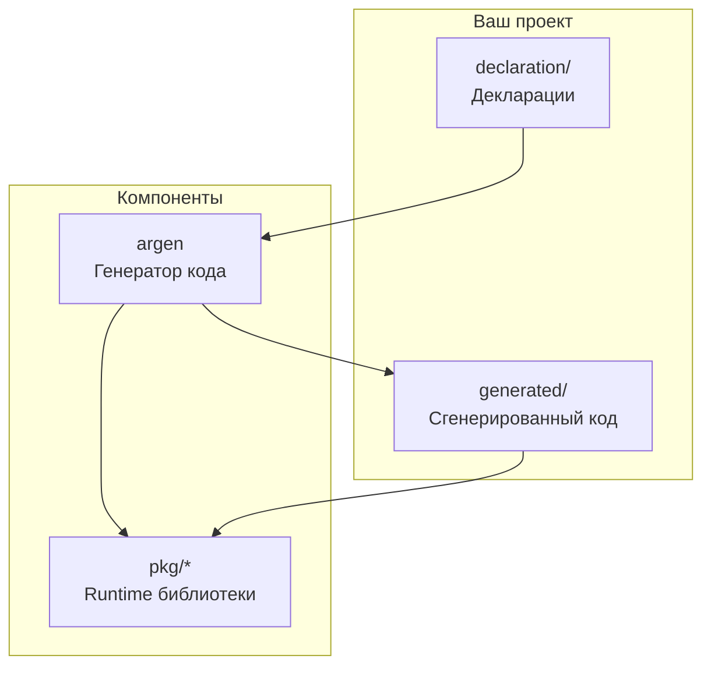

# Начало работы

Этот раздел поможет вам установить go-activerecord и создать первую модель.

## Содержание раздела

- [Установка](installation.md) — установка argen и добавление зависимостей
- [Быстрый старт](quickstart.md) — создание первой модели за 5 минут

## Обзор

go-activerecord состоит из двух компонентов:

| Компонент | Описание |
|-----------|----------|
| **argen** | CLI утилита для генерации кода из деклараций |
| **pkg/** | Runtime библиотеки для работы с БД |

## Требования

- **Go 1.19+** (проверяется при сборке)
- **PostgreSQL** или **Octopus/Tarantool 1.5**

!!! info "Примечание"
    Версия Go проверяется скриптом `scripts/goversioncheck.sh` при сборке.

## Следующие шаги

- [Установка](installation.md) — установите argen и зависимости
- [Быстрый старт](quickstart.md) — создайте первую модель
