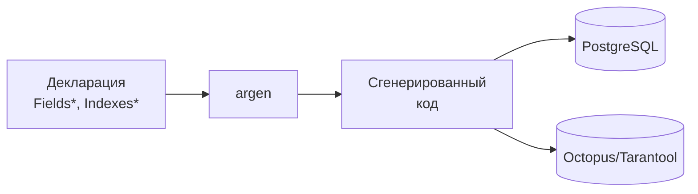

# go-activerecord

Высокопроизводительный генератор ORM для Go с поддержкой Octopus/Tarantool 1.5 и PostgreSQL.

!!! note "Псевдо-Active Record"
    В отличие от классического Active Record, изменения **не записываются в БД автоматически**. Они накапливаются в памяти и отправляются одним запросом при явном вызове `Update()`. Это обеспечивает контроль, атомарность и высокую производительность. Подробнее в разделе [Архитектура](architecture/index.md).



## Ключевые возможности

| Возможность | Описание |
|-------------|----------|
| **Генерация кода** | Типобезопасный код без reflection в runtime |
| **Мульти-бэкенд** | PostgreSQL и Octopus/Tarantool 1.5 |
| **Атомарные операции** | Inc, Dec, SetBit, ClearBit, And, Or, Xor |
| **Шардирование** | Встроенная поддержка шардов и реплик |
| **Сериализаторы** | Json, Printf, Mapstructure, пользовательские |
| **Метрики** | Prometheus-совместимые метрики из коробки |

## Быстрый пример

```go
// Декларация модели
//ar:serverConf:mydb
//ar:namespace:users
//ar:backend:postgres
type FieldsUser struct {
    Id     int64  `ar:"primary_key"`
    Email  string `ar:"unique;size:256;selector:SelectByEmail"`
    Name   string `ar:"size:256"`
    Flags  uint32 `ar:""`
}

type FlagsUser struct {
    Flags string `ar:"flags:Active,Verified,Premium"`
}
```

```go
// Использование сгенерированного кода
user := user.New(ctx)
user.SetEmail("john@example.com")
user.SetName("John Doe")
user.Insert(ctx)

// Атомарные битовые операции
user.SetBitFlags(user.FlagsVerifiedFlag)
user.Update(ctx)
```

!!! tip "Совет"
    Начните с раздела [Быстрый старт](getting-started/quickstart.md) для создания первой модели за 5 минут.

## Следующие шаги

- [Установка](getting-started/installation.md) — установка argen и зависимостей
- [Быстрый старт](getting-started/quickstart.md) — создание первой модели
- [Архитектура](architecture/index.md) — как работает генератор кода
- [Справочник тегов](reference/tags.md) — все доступные теги полей
