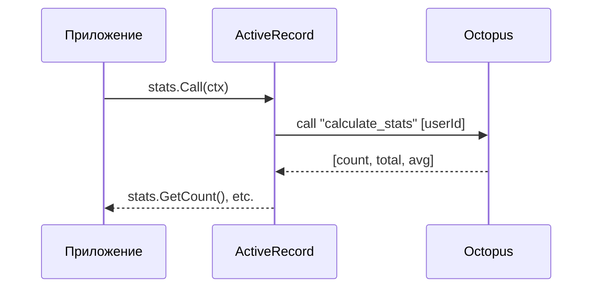

# Хранимые процедуры

Вызов Lua процедур в Octopus через ProcFields*.

## Обзор

ProcFields* позволяет вызывать хранимые процедуры Octopus:



## Декларация

```go
//ar:serverConf:octconf
//ar:namespace:calculate_stats   // Имя Lua процедуры
//ar:backend:octopus
type ProcFieldsStats struct {
    // Входные параметры
    UserId    string `ar:"input;size:32"`
    StartDate string `ar:"input;size:10"`
    EndDate   string `ar:"input;size:10"`

    // Выходные параметры (порядок = порядок в tuple результата)
    OrderCount  uint32 `ar:"output"`
    TotalAmount int64  `ar:"output"`
    AvgAmount   int64  `ar:"output"`
}
```

## Теги

| Тег | Описание |
|-----|----------|
| `input` | Входной параметр |
| `output` | Выходной параметр |
| `output:N` | Выходной с явным порядковым номером |
| `serializer` | Сериализатор для параметра |
| `size` | Размер параметра |

## Использование

```go
// Создание объекта для вызова
stats := stats.New(ctx)

// Установка входных параметров
stats.SetUserId("12345")
stats.SetStartDate("2024-01-01")
stats.SetEndDate("2024-12-31")

// Вызов процедуры
if err := stats.Call(ctx); err != nil {
    return fmt.Errorf("call failed: %w", err)
}

// Чтение результатов
fmt.Printf("Orders: %d\n", stats.GetOrderCount())
fmt.Printf("Total: %d\n", stats.GetTotalAmount())
fmt.Printf("Average: %d\n", stats.GetAvgAmount())
```

## Входные параметры

### Только строковые типы

Для Octopus входные параметры могут быть только строкового типа:

```go
type ProcFieldsMyProc struct {
    // ✅ Правильно
    UserId string `ar:"input;size:32"`
    Data   []byte `ar:"input;size:1024"`

    // ❌ Неправильно — не строковый тип
    // Count int `ar:"input"`
}
```

### Сложные типы через сериализатор

```go
type ProcFieldsMyProc struct {
    // Сериализатор преобразует структуру в строку
    Params string `ar:"input;serializer:Json;size:2048"`
}

type SerializersMyProc struct {
    Params *MyParamsStruct `ar:"pkg:github.com/myapp/types;object:ParamsS"`
}
```

### Списки через сериализатор

```go
type ProcFieldsMyProc struct {
    Tags string `ar:"input;serializer:TagList;size:512"`
}

type SerializersMyProc struct {
    Tags []string `ar:"pkg:github.com/myapp/serializers;object:TagListS"`
}
```

Сериализатор возвращает `[]string` — каждый элемент станет отдельным параметром:

```go
func TagListSMarshal(tags []string) ([]string, error) {
    return tags, nil  // ["tag1", "tag2"] → отдельные параметры
}
```

## Выходные параметры

### Порядок полей

Порядок объявления `output` полей должен соответствовать порядку в tuple результата:

```go
type ProcFieldsStats struct {
    // Tuple результата: [count, total, avg]
    OrderCount  uint32 `ar:"output"`  // tuple[0]
    TotalAmount int64  `ar:"output"`  // tuple[1]
    AvgAmount   int64  `ar:"output"`  // tuple[2]
}
```

### Явный порядковый номер

```go
type ProcFieldsStats struct {
    // Можно указать порядок явно
    AvgAmount   int64  `ar:"output:2"`
    TotalAmount int64  `ar:"output:1"`
    OrderCount  uint32 `ar:"output:0"`
}
```

### Неполный результат

Если tuple содержит меньше полей, оставшиеся будут пустыми:

```go
// Ожидаем 3 поля, пришло 2
stats.GetOrderCount()   // Значение из tuple[0]
stats.GetTotalAmount()  // Значение из tuple[1]
stats.GetAvgAmount()    // 0 (по умолчанию)
```

## Пример Lua процедуры

```lua
-- В Octopus
box.schema.func.create('calculate_stats', {
    language = 'LUA',
    body = [[
        function(user_id, start_date, end_date)
            local count = 0
            local total = 0

            -- Логика расчёта...

            return {count, total, total / count}
        end
    ]]
})
```

## Сериализаторы для параметров

### Входные параметры

Сериализатор для входных параметров должен возвращать `string` или `[]string`:

```go
// Один параметр
func ParamsMarshal(p *Params) (string, error) {
    data, _ := json.Marshal(p)
    return string(data), nil
}

// Несколько параметров
func ParamsListMarshal(params []Param) ([]string, error) {
    result := make([]string, len(params))
    for i, p := range params {
        data, _ := json.Marshal(p)
        result[i] = string(data)
    }
    return result, nil
}
```

### Выходные параметры

```go
type ProcFieldsMyProc struct {
    Input  string `ar:"input"`
    Result string `ar:"output;serializer:Json"`
}

type SerializersMyProc struct {
    Result *MyResultStruct `ar:"pkg:github.com/myapp/types;object:ResultS"`
}
```

## Обработка ошибок

```go
stats := stats.New(ctx)
stats.SetUserId("12345")

err := stats.Call(ctx)
if err != nil {
    // Ошибка вызова процедуры
    if errors.Is(err, octopus.ErrProcNotFound) {
        return fmt.Errorf("procedure not found")
    }
    return err
}
```

## Метрики

| Метрика | Описание |
|---------|----------|
| `call_proc` | Время вызова процедуры |
| `call_proc_preparedb` | Ошибка подготовки соединения |
| `call_proc` (error) | Ошибка выполнения процедуры |

## Best Practices

### 1. Валидируйте входные параметры

```go
func CallStats(ctx context.Context, userId string) (*Stats, error) {
    if userId == "" {
        return nil, fmt.Errorf("userId is required")
    }

    stats := stats.New(ctx)
    stats.SetUserId(userId)
    // ...
}
```

### 2. Используйте таймауты

```go
ctx, cancel := context.WithTimeout(ctx, 5*time.Second)
defer cancel()

stats.Call(ctx)
```

### 3. Логируйте вызовы

```go
log.Printf("Calling calculate_stats for user %s", userId)
if err := stats.Call(ctx); err != nil {
    log.Printf("calculate_stats failed: %v", err)
    return err
}
```

## Следующие шаги

- [Работа с tuples](tuples.md) — структура данных
- [Связи и процедуры](../declaration/relations.md) — декларация ProcFields
