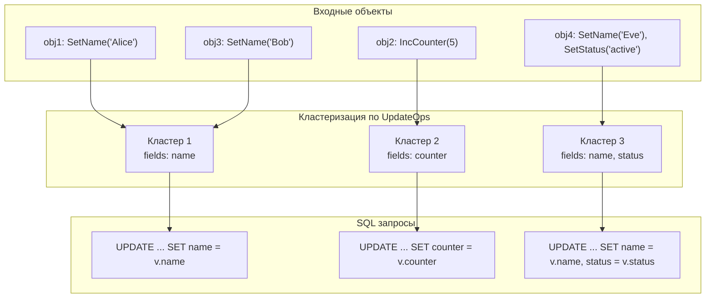
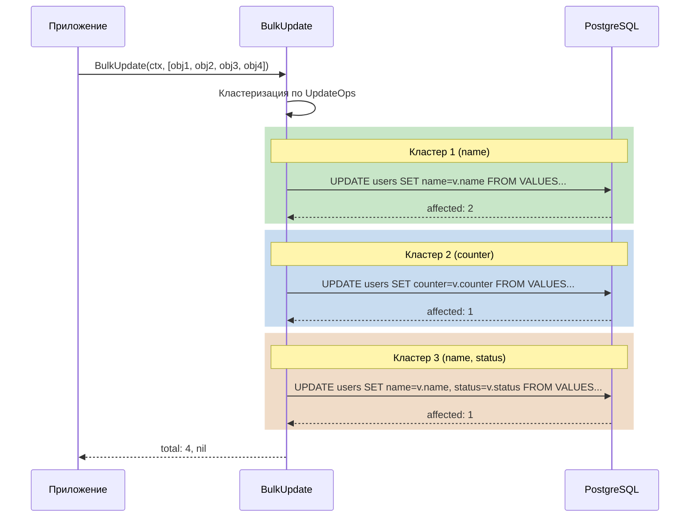

# BulkUpdate

Массовое обновление записей через SQL `UPDATE ... FROM VALUES`.

!!! warning "Не один запрос!"
    BulkUpdate **не гарантирует** обновление всех записей одним запросом. Записи группируются по набору изменяемых полей, и для каждой группы выполняется отдельный SQL запрос.

## Сигнатура

```go
func BulkUpdate(ctx context.Context, objs []*User) (updatedCount int, err error)
```

## Базовое использование

```go
// Получаем пользователей
users, err := user.SelectByIds(ctx, []int64{1, 2, 3})
if err != nil {
    return err
}

// Изменяем
for _, u := range users {
    u.SetStatus("active")
    u.SetUpdatedAt(time.Now().Unix())
}

// Массовое обновление
updatedCount, err := user.BulkUpdate(ctx, users)
if err != nil {
    return fmt.Errorf("bulk update failed: %w", err)
}

fmt.Printf("Updated %d/%d users\n", updatedCount, len(users))
```

## Как это работает

### 1. Кластеризация объектов

BulkUpdate группирует объекты по **набору изменяемых полей**. Объекты попадают в один кластер только если у них изменены **одинаковые поля**.



**Пример кода:**

```go
users := []*user.User{obj1, obj2, obj3, obj4}
obj1.SetName("Alice")                    // fields: {name}
obj2.IncCounter(5)                       // fields: {counter}
obj3.SetName("Bob")                      // fields: {name}
obj4.SetName("Eve"); obj4.SetStatus("active")  // fields: {name, status}

// BulkUpdate создаст 3 кластера и выполнит 3 SQL запроса:
// Кластер 1: obj1, obj3 → UPDATE ... SET name
// Кластер 2: obj2       → UPDATE ... SET counter
// Кластер 3: obj4       → UPDATE ... SET name, status
count, err := user.BulkUpdate(ctx, users)
```

!!! tip "Для минимума запросов"
    Чтобы BulkUpdate выполнил **один** SQL запрос, все объекты должны изменять **одинаковый набор полей**.

### 2. Генерация SQL

Для каждого кластера генерируется один SQL:

```sql
UPDATE users AS t
SET
    name = v.name,
    updated_at = v.updated_at
FROM (VALUES
    ($1, $2, $3),  -- (id, name, updated_at)
    ($4, $5, $6)
) AS v(id, name, updated_at)
WHERE t.id = v.id
```

### 3. Выполнение



- Запросы выполняются **последовательно** для каждого кластера
- Возвращается **суммарное** количество обновлённых строк
- При ошибке в кластере N — кластеры 1..N-1 уже закоммичены

!!! danger "Нет атомарности"
    Если ошибка произойдёт при обновлении второго кластера, записи из первого кластера **уже будут обновлены** в БД. Откат невозможен без внешней транзакции.

## Валидация

Для каждого объекта проверяется:

- `Exists == true` — объект из БД
- `len(UpdateOps) > 0` — есть изменения

Объекты без изменений пропускаются.

## Метрики

| Метрика | Описание |
|---------|----------|
| `bulk_update_request` | Количество вызовов BulkUpdate |
| `bulk_update_objects` | Общее количество объектов |
| `bulk_update_success` | Успешно обновлённые строки |
| `bulk_update_empty` | Объекты без изменений |
| `bulk_update_notexists` | Попытка обновить несуществующий объект |
| `bulk_update_failed` | Ошибки выполнения |

## Рекомендации по производительности

### Малые пакеты (< 1000 объектов)

```go
updatedCount, err := user.BulkUpdate(ctx, users)
```

### Большие пакеты (> 1000 объектов)

Разбивайте на батчи:

```go
batchSize := 500
totalUpdated := 0

for i := 0; i < len(users); i += batchSize {
    end := i + batchSize
    if end > len(users) {
        end = len(users)
    }

    batch := users[i:end]
    count, err := user.BulkUpdate(ctx, batch)
    if err != nil {
        return fmt.Errorf("batch %d-%d failed: %w", i, end, err)
    }
    totalUpdated += count
}
```

!!! warning "Автокоммит"
    BulkUpdate работает в режиме автокоммита. Каждый кластер коммитится отдельно. Подробнее: [Транзакции и автокоммит](../architecture/transactions.md).

## Сравнение с циклом Update

```go
// Вариант 1: Цикл с Update() — N запросов
for _, u := range users {
    if err := u.Update(ctx); err != nil {
        return err
    }
}

// Вариант 2: BulkUpdate — 1-K запросов (K = количество кластеров)
count, err := user.BulkUpdate(ctx, users)
```

**BulkUpdate лучше когда:**

- Много объектов (> 10)
- Объекты обновляют **одинаковые поля** (один кластер)
- Не требуется атомарность

**Цикл лучше когда:**

- Мало объектов (1-5)
- Объекты обновляют **разные поля**
- Нужна специфическая логика между обновлениями

## Ограничения

### Множественные SQL запросы

BulkUpdate генерирует **отдельный SQL для каждого уникального набора полей**:

| Сценарий | Количество запросов |
|----------|---------------------|
| Все объекты изменяют одинаковые поля | 1 |
| 100 объектов, 5 разных наборов полей | 5 |
| Каждый объект изменяет уникальный набор полей | N (равно числу объектов) |

!!! warning "Худший случай"
    Если каждый объект изменяет разные поля, BulkUpdate деградирует до N отдельных запросов — хуже, чем цикл с `Update()`, из-за накладных расходов на кластеризацию.

### Отсутствие атомарности

При ошибке в кластере K все предыдущие кластеры (1..K-1) **уже обновлены**:

```go
// obj1, obj2 изменяют name → Кластер 1
// obj3 изменяет counter → Кластер 2

count, err := user.BulkUpdate(ctx, []*user.User{obj1, obj2, obj3})
// Если ошибка при обновлении obj3:
// - obj1, obj2 УЖЕ обновлены в БД
// - obj3 НЕ обновлён
// - err != nil, count == 2
```

### Размер SQL

- PostgreSQL имеет лимит на размер запроса
- Для > 1000 объектов разбивайте на батчи

### Не поддерживаются idempotency keys

- Для идемпотентных операций используйте `Update()` в цикле

## Пример с фильтрацией

```go
func UpdateOnlyModified(ctx context.Context, users []*user.User) error {
    // Фильтруем только изменённые
    modified := make([]*user.User, 0, len(users))
    for _, u := range users {
        if len(u.BaseField.UpdateOps) > 0 {
            modified = append(modified, u)
        }
    }

    if len(modified) == 0 {
        return nil
    }

    count, err := user.BulkUpdate(ctx, modified)
    if err != nil {
        return err
    }

    log.Printf("Updated %d objects", count)
    return nil
}
```

## Следующие шаги

- [BulkInsertReplace](bulk-insert.md) — массовая вставка
- [CRUD операции](../usage/crud.md) — обычные операции
