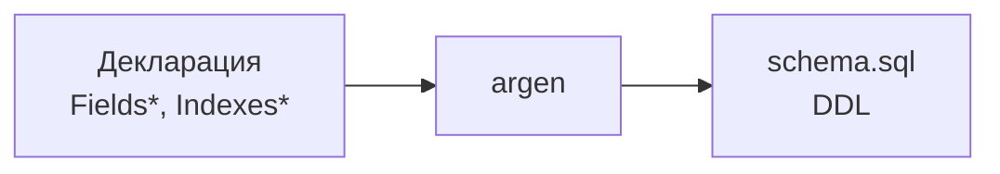

# Генератор схемы

Автоматическая генерация DDL схемы PostgreSQL из деклараций моделей.

## Обзор

Генератор создаёт SQL DDL из деклараций go-activerecord:



## Использование

```bash
# Генерация схемы
argen --path "model/repository" \
      --declaration "declaration" \
      --destination "generated" \
      --schema-output schema.sql
```

## Пример вывода

Для декларации:

```go
//ar:serverConf:mydb
//ar:namespace:users
//ar:backend:postgres
type FieldsUser struct {
    Id        int64  `ar:"primary_key;init_by_db"`
    Email     string `ar:"unique;size:256"`
    Name      string `ar:"size:128"`
    Status    string `ar:"size:32"`
    Flags     uint32 `ar:""`
    CreatedAt int64  `ar:""`
}

type IndexesUser struct {
    StatusCreated bool `ar:"fields:Status,CreatedAt;order:Status asc,CreatedAt desc"`
    ActiveUsers   bool `ar:"fields:CreatedAt;condition:Status[=]active&&Flags&1[=]1"`
}
```

Генерируется:

```sql
-- DDL Schema for table users
-- Generated by argen

CREATE TABLE IF NOT EXISTS users (
    id BIGSERIAL NOT NULL,
    email VARCHAR(256) NOT NULL DEFAULT '',
    name VARCHAR(128) NOT NULL DEFAULT '',
    status VARCHAR(32) NOT NULL DEFAULT '',
    flags BIGINT NOT NULL DEFAULT 0,
    created_at BIGINT NOT NULL DEFAULT 0,
    PRIMARY KEY (id)
);

CREATE UNIQUE INDEX IF NOT EXISTS idx_users_email ON users (email);

CREATE INDEX IF NOT EXISTS idx_users_statuscreated ON users (status ASC, created_at DESC);

CREATE INDEX IF NOT EXISTS idx_users_activeusers ON users (created_at)
    WHERE status = 'active' AND flags & 1 = 1;
```

## Поддерживаемые возможности

### Типы данных

| Go тип | PostgreSQL | С init_by_db |
|--------|------------|--------------|
| `int64` | BIGINT | BIGSERIAL |
| `int32`, `int` | INTEGER | SERIAL |
| `int16` | SMALLINT | SMALLSERIAL |
| `uint64`, `uint32` | BIGINT | - |
| `uint16`, `uint8` | INTEGER | - |
| `float64` | DOUBLE PRECISION | - |
| `float32` | REAL | - |
| `bool` | BOOLEAN | - |
| `string` | VARCHAR(n) / TEXT | - |
| `[]byte` | BYTEA | - |
| `time.Time` | TIMESTAMP | - |

### NOT NULL и DEFAULT

Все поля генерируются как NOT NULL (Go не имеет null):

```sql
name VARCHAR(128) NOT NULL DEFAULT ''
counter BIGINT NOT NULL DEFAULT 0
is_active BOOLEAN NOT NULL DEFAULT false
created_at TIMESTAMP NOT NULL DEFAULT '0001-01-01 00:00:00'
```

### Индексы

```go
type IndexesUser struct {
    // Уникальный индекс
    Email bool `ar:"fields:Email;unique"`

    // Составной индекс с сортировкой
    StatusDate bool `ar:"fields:Status,CreatedAt;order:Status asc,CreatedAt desc"`

    // Условный индекс
    Active bool `ar:"fields:Id;condition:Status[=]active&&DeletedAt[is null]"`
}
```

```sql
CREATE UNIQUE INDEX idx_users_email ON users (email);
CREATE INDEX idx_users_statusdate ON users (status ASC, created_at DESC);
CREATE INDEX idx_users_active ON users (id) WHERE status = 'active' AND deleted_at IS NULL;
```

### Foreign Keys

Из `FieldsObject*` генерируются FK:

```go
type FieldsObjectOrder struct {
    User int64 `ar:"key:Id;object:User;field:UserId"`
}
```

```sql
CONSTRAINT orders_userid_fkey FOREIGN KEY (userid)
    REFERENCES users (id) ON DELETE CASCADE
```

## Именование

| Элемент | Формат | Пример |
|---------|--------|--------|
| Таблица | snake_case из namespace | `users` |
| Колонки | lowercase | `created_at` |
| PK | `{table}_pkey` | `users_pkey` |
| Индексы | `idx_{table}_{name}` | `idx_users_email` |
| FK | `{table}_{column}_fkey` | `orders_userid_fkey` |

## JSON представление

Генератор также создаёт JSON схему:

```go
type Table struct {
    Name        string       `json:"name"`
    Backend     string       `json:"backend"`
    Columns     []Column     `json:"columns"`
    PrimaryKey  []string     `json:"primary_key"`
    Indexes     []Index      `json:"indexes"`
    ForeignKeys []ForeignKey `json:"foreign_keys"`
}

type Column struct {
    Name       string `json:"name"`
    Type       string `json:"type"`
    GoType     string `json:"go_type"`
    PrimaryKey bool   `json:"primary_key"`
    NotNull    bool   `json:"not_null"`
    Default    string `json:"default"`
    Size       int64  `json:"size"`
    Position   int    `json:"position"`
}
```

## Миграции

Генератор поддерживает создание миграций из diff:

```go
// Внутренний API
diff := schema.CompareTables(oldTable, newTable)
migration, _ := generator.GenerateMigration(diff, "users")
```

Результат:

```go
type Migration struct {
    Up          []string  // ALTER TABLE ADD COLUMN ...
    Down        []string  // ALTER TABLE DROP COLUMN ...
    Description string    // "add column email, drop index idx_old"
}
```

### Поддерживаемые изменения

| Изменение | Up | Down |
|-----------|-----|------|
| Добавление колонки | ADD COLUMN | DROP COLUMN |
| Удаление колонки | DROP COLUMN | -- комментарий (см. [roadmap](../roadmap.md)) |
| Изменение типа | ALTER TYPE | ALTER TYPE |
| Изменение NOT NULL | SET/DROP NOT NULL | DROP/SET NOT NULL |
| Изменение DEFAULT | SET/DROP DEFAULT | SET/DROP DEFAULT |
| Добавление индекса | CREATE INDEX | DROP INDEX |
| Удаление индекса | DROP INDEX | -- комментарий (см. [roadmap](../roadmap.md)) |

## Ограничения

!!! warning "Текущие ограничения"

1. **Схема** — всегда `public` (планируется `//ar:schema:`)
2. **ENUM** — не поддерживается (планируется)
3. **Партиционирование** — не поддерживается
4. **Триггеры БД** — не генерируются
5. **Stored procedures** — не генерируются

## Makefile интеграция

```makefile
.PHONY: schema
schema: ## Generate PostgreSQL DDL schema
	argen --path "model/repository" --schema-output schema.sql

.PHONY: migrate
migrate: schema ## Generate and apply migrations
	psql -d mydb -f schema.sql
```

## Best Practices

### 1. Храните схему в репозитории

```
project/
├── model/
│   └── repository/
│       └── declaration/
└── database/
    └── schema.sql      # Сгенерированная схема
```

### 2. Используйте для документации

```bash
# Генерация схемы для документации
argen --schema-output docs/database-schema.sql
```

### 3. Сравнивайте с production

```bash
# Экспорт текущей схемы
pg_dump -s mydb > current.sql

# Генерация из деклараций
argen --schema-output expected.sql

# Сравнение
diff current.sql expected.sql
```

## Следующие шаги

- [Индексы](../declaration/indexes.md) — декларация индексов
- [Поля](../declaration/fields.md) — декларация полей
