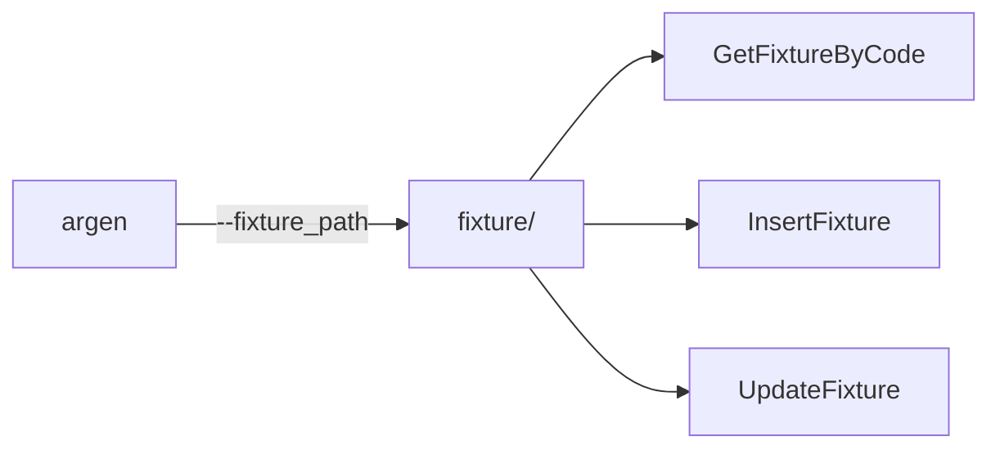

# Тестирование

Подходы к тестированию кода, использующего go-activerecord.

## Содержание раздела

- [Фикстуры](fixtures.md) — генерация тестовых данных

## Обзор

go-activerecord предоставляет инструменты для тестирования:



## Генерация фикстур

```bash
argen --path "model/repository" \
      --declaration "declaration" \
      --destination "generated" \
      --fixture_path "testutil/fixture"
```

Создаётся структура:

```
testutil/fixture/
├── fixture/
│   └── data/
│       ├── user.yaml      # Данные для фикстур
│       └── product.yaml
└── user/
    └── fixture.go         # Сгенерированный код
```

## Build tag

Тесты с сгенерированным кодом требуют build tag:

```go
//go:build activerecord

package mytest

import "testing"

func TestWithActiveRecord(t *testing.T) {
    // ...
}
```

Запуск:

```bash
go test -tags=activerecord ./...
```

## Mock server

Для Octopus доступен mock server:

```go
import "github.com/Educentr/go-activerecord/v3/pkg/octopus"

func TestWithMock(t *testing.T) {
    server := octopus.NewMockServer()
    defer server.Close()

    // Настройка mock
    server.On("select", ...).Return(...)

    // Тест
}
```

## Best Practices

### 1. Изолируйте тесты

```go
func TestUser(t *testing.T) {
    // Используйте отдельную БД для тестов
    ctx := setupTestDB(t)
    defer teardownTestDB(ctx)

    // ...
}
```

### 2. Используйте фикстуры

```go
func TestSelectUser(t *testing.T) {
    fix, _ := fixture.GetUserByCode(ctx, "test-user")
    // Фикстура доступна для проверок
}
```

### 3. Проверяйте граничные случаи

```go
func TestEmptyResult(t *testing.T) {
    users, err := user.SelectByStatus(ctx, "nonexistent", limiter)
    require.NoError(t, err)
    require.Empty(t, users)
}
```

## Следующие шаги

- [Фикстуры](fixtures.md) — подробнее о фикстурах
