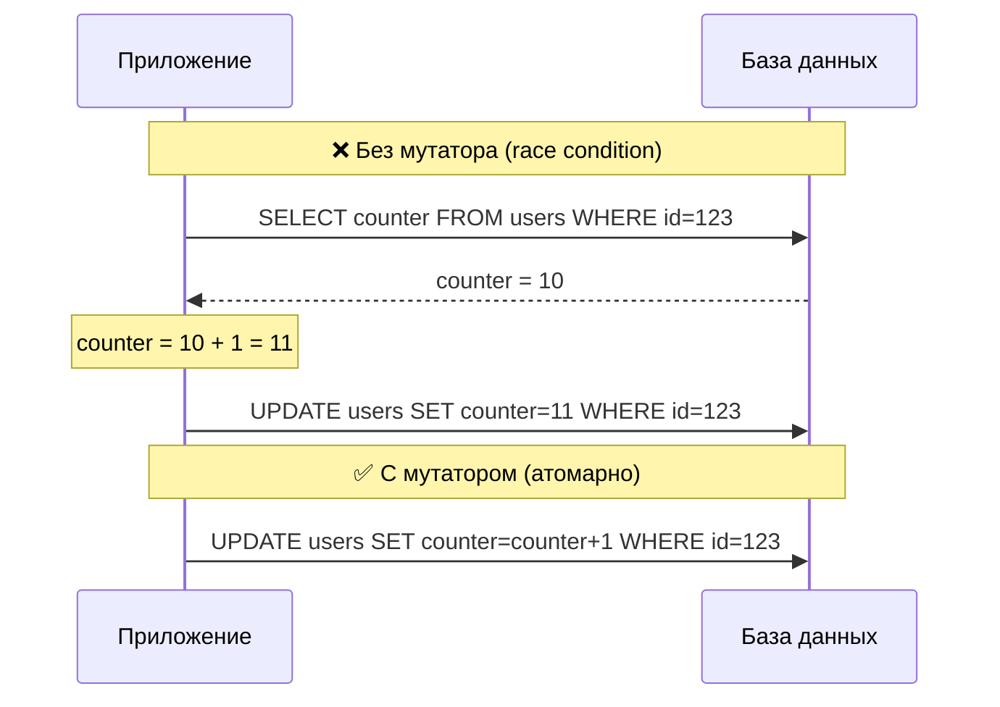

# Атомарные операции

Мутаторы обеспечивают атомарное выполнение операций на уровне БД.

## Проблема race condition

```go
// ❌ Плохо — race condition
user, _ := user.SelectById(ctx, 123)
user.SetCounter(user.GetCounter() + 1)  // Чтение + модификация в памяти
user.Update(ctx)                         // Запись

// Между чтением и записью другой процесс мог изменить counter
```

```go
// ✅ Хорошо — атомарная операция
user, _ := user.SelectById(ctx, 123)
user.IncCounter(1)   // Операция выполнится в БД
user.Update(ctx)
```

## Как это работает



## Арифметические мутаторы

### Inc (инкремент)

```go
type FieldsUser struct {
    Counter uint32 `ar:"mutators:inc"`
}
```

```go
user.IncCounter(10)  // counter = counter + 10
user.Update(ctx)
```

### Dec (декремент)

```go
type FieldsUser struct {
    Points int64 `ar:"mutators:dec"`
}
```

```go
user.DecPoints(5)  // points = points - 5
user.Update(ctx)
```

## Битовые мутаторы

### SetBit

Устанавливает биты (OR):

```go
type FieldsUser struct {
    Flags uint32 `ar:"mutators:set_bit"`
}
```

```go
user.SetBitFlags(0x04)  // flags = flags | 0x04
user.Update(ctx)
```

### ClearBit

Очищает биты (AND NOT):

```go
user.ClearBitFlags(0x01)  // flags = flags & ~0x01
user.Update(ctx)
```

### And, Or, Xor

```go
type FieldsUser struct {
    Flags uint32 `ar:"mutators:and,or,xor"`
}
```

```go
user.OrFlags(0x10)   // flags = flags | 0x10
user.AndFlags(0xFF)  // flags = flags & 0xFF
user.XorFlags(0x08)  // flags = flags ^ 0x08 (toggle)
user.Update(ctx)
```

## Именованные флаги

### Объявление

```go
type FieldsUser struct {
    Flags uint32 `ar:""`
}

type FlagsUser struct {
    Flags string `ar:"flags:Active,Verified,Premium,_,Admin,Banned"`
}
```

### Генерируемые константы

```go
const (
    FlagsActiveFlag   = 1 << 0  // 0x01
    FlagsVerifiedFlag = 1 << 1  // 0x02
    FlagsPremiumFlag  = 1 << 2  // 0x04
    // позиция 3 пропущена
    FlagsAdminFlag    = 1 << 4  // 0x10
    FlagsBannedFlag   = 1 << 5  // 0x20
)
```

### Использование

```go
// Установка флага
user.SetBitFlags(user.FlagsPremiumFlag)

// Очистка флага
user.ClearBitFlags(user.FlagsActiveFlag)

// Несколько флагов сразу
user.SetBitFlags(user.FlagsActiveFlag | user.FlagsVerifiedFlag)

// Применение
user.Update(ctx)

// Проверка флага
if user.GetFlags() & user.FlagsVerifiedFlag != 0 {
    fmt.Println("Пользователь верифицирован")
}

// Проверка нескольких флагов (любой из)
if user.GetFlags() & (user.FlagsPremiumFlag | user.FlagsAdminFlag) != 0 {
    fmt.Println("Premium или Admin")
}

// Проверка всех флагов
mask := user.FlagsPremiumFlag | user.FlagsVerifiedFlag
if user.GetFlags() & mask == mask {
    fmt.Println("Оба флага установлены")
}
```

## Комбинирование операций

Несколько мутаторов в одном Update:

```go
user, _ := user.SelectById(ctx, 123)

// Все операции накапливаются
user.IncLoginCount(1)
user.DecPoints(10)
user.SetBitFlags(user.FlagsActiveFlag)
user.ClearBitFlags(user.FlagsBannedFlag)

// Один запрос к БД со всеми операциями
user.Update(ctx)
```

SQL для PostgreSQL:
```sql
UPDATE users SET
    login_count = login_count + 1,
    points = points - 10,
    flags = (flags | 1) & ~32
WHERE id = 123
```

## Порядок применения

При `Update()` операции применяются в порядке:

1. Обычные SET (из `Set*` методов)
2. Арифметические мутаторы (inc, dec)
3. Битовые мутаторы (and, or, xor, set_bit, clear_bit)

```go
user.SetCounter(100)      // 1. SET counter = 100
user.IncCounter(10)       // 2. counter = counter + 10 (станет 110)
user.SetBitFlags(0x01)    // 3. flags = flags | 1

user.Update(ctx)
```

## Синхронизация значений

После `Update()` значения в объекте синхронизируются:

```go
user, _ := user.SelectById(ctx, 123)
fmt.Println(user.GetCounter())  // 100

user.IncCounter(10)
user.Update(ctx)

fmt.Println(user.GetCounter())  // 110 (обновлённое значение)
```

## Практические примеры

### Счётчик просмотров

```go
func IncrementViews(ctx context.Context, articleId int64) error {
    article, err := article.SelectById(ctx, articleId)
    if err != nil {
        return err
    }

    article.IncViewCount(1)
    return article.Update(ctx)
}
```

### Система достижений

```go
const (
    AchievementFirst    = 1 << 0
    AchievementHundred  = 1 << 1
    AchievementThousand = 1 << 2
)

func CheckAchievements(ctx context.Context, userId int64) error {
    user, _ := user.SelectById(ctx, userId)
    count := user.GetPostCount()

    var newAchievements uint32

    if count >= 1 && user.GetAchievements() & AchievementFirst == 0 {
        newAchievements |= AchievementFirst
    }
    if count >= 100 && user.GetAchievements() & AchievementHundred == 0 {
        newAchievements |= AchievementHundred
    }

    if newAchievements != 0 {
        user.SetBitAchievements(newAchievements)
        return user.Update(ctx)
    }

    return nil
}
```

### Переключение статуса

```go
func ToggleFeature(ctx context.Context, userId int64, feature uint32) error {
    user, _ := user.SelectById(ctx, userId)
    user.XorFlags(feature)  // Toggle bit
    return user.Update(ctx)
}
```

## Best Practices

### 1. Используйте мутаторы для счётчиков

```go
// ❌ Race condition
user.SetBalance(user.GetBalance() - amount)

// ✅ Атомарно
user.DecBalance(amount)
```

### 2. Используйте именованные флаги

```go
// ❌ Магические числа
user.SetBitFlags(0x04)

// ✅ Читаемо
user.SetBitFlags(user.FlagsPremiumFlag)
```

### 3. Группируйте операции

```go
// ❌ Несколько запросов
user.IncCounter(1)
user.Update(ctx)
user.SetBitFlags(flag)
user.Update(ctx)

// ✅ Один запрос
user.IncCounter(1)
user.SetBitFlags(flag)
user.Update(ctx)
```

## Следующие шаги

- [Конфигурация](configuration.md) — настройка подключений
- [Мутаторы и флаги](../declaration/mutators.md) — декларация мутаторов
