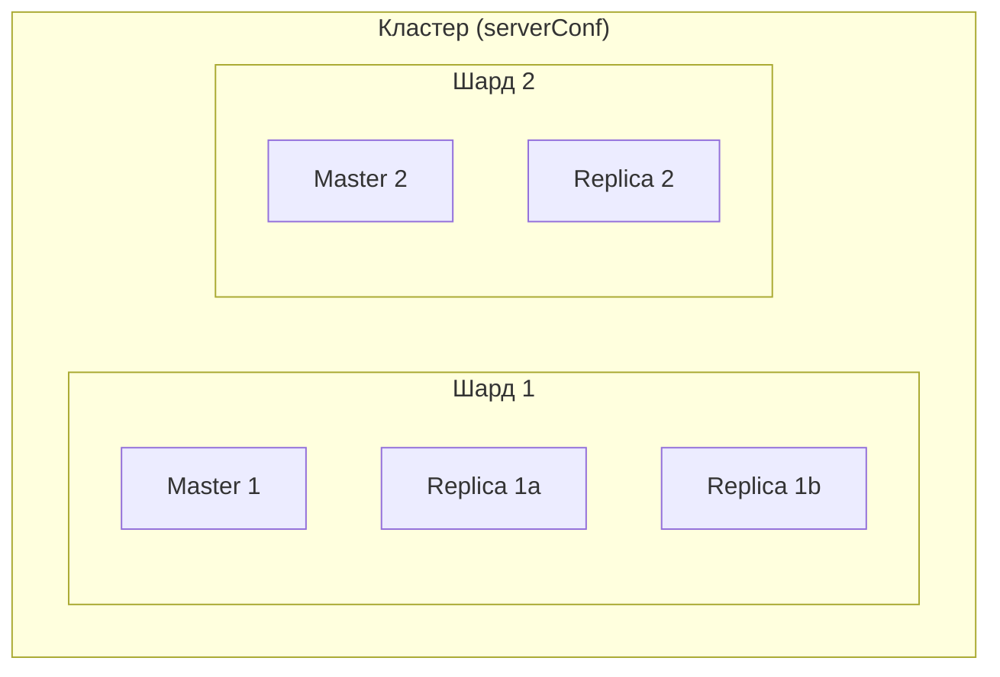

# Конфигурация

Настройка подключений к базам данных.

## Обзор

Конфигурация строится вокруг шардов. Каждый шард может иметь мастера и реплики:



## Интерфейс конфигурации

```go
type ConfigInterface interface {
    GetLastUpdateTime() time.Time
    GetBool(ctx context.Context, path string, dfl ...bool) bool
    GetBoolIfExists(ctx context.Context, path string) (bool, bool)
    GetDuration(ctx context.Context, path string, dfl ...time.Duration) time.Duration
    GetDurationIfExists(ctx context.Context, path string) (time.Duration, bool)
    GetInt(ctx context.Context, path string, dfl ...int) int
    GetIntIfExists(ctx context.Context, path string) (int, bool)
    GetString(ctx context.Context, path string, dfl ...string) string
    GetStringIfExists(ctx context.Context, path string) (string, bool)
    GetStrings(ctx context.Context, path string, dfl []string) []string
    GetStruct(ctx context.Context, path string, valuePtr interface{}) (bool, error)
}
```

## Дерево параметров

Для `//ar:serverConf:mydb`:

```
mydb/
├── Timeout      # Таймаут по умолчанию (Duration)
├── PoolSize     # Размер пула по умолчанию (int)
├── master       # Адреса мастеров (string, через запятую)
├── replica      # Адреса реплик (string, через запятую)
└── 1/           # Шард 1 (опционально)
    ├── Timeout  # Таймаут шарда
    ├── PoolSize # Пул шарда
    ├── master   # Мастера шарда
    └── replica  # Реплики шарда
```

## Варианты конфигурации

### Простой (один сервер)

```
mydb = "127.0.0.1:5432"
mydb/Timeout = 200ms
mydb/PoolSize = 10
```

### С репликой

```
mydb/Timeout = 200ms
mydb/PoolSize = 10
mydb/master = "10.0.1.1:5432"
mydb/replica = "10.0.1.2:5432"
```

### Несколько мастеров

```
mydb/master = "10.0.1.1:5432,10.0.1.2:5432"
mydb/replica = "10.0.2.1:5432,10.0.2.2:5432"
```

!!! warning "Несколько мастеров"
    Запись идёт во все мастера. Нет транзакционной целостности между ними. Используйте для кэшей.

### Шардирование

```
mydb/Timeout = 200ms
mydb/PoolSize = 10

mydb/1/master = "10.0.1.1:5432"
mydb/1/replica = "10.0.1.2:5432"
mydb/1/Timeout = 100ms

mydb/2/master = "10.0.2.1:5432"
mydb/2/replica = "10.0.2.2:5432"
mydb/2/PoolSize = 20
```

## Реализация конфигурации

### Статическая конфигурация

```go
package config

import (
    "context"
    "time"
)

type ARConfig struct {
    updatedAt time.Time
    values    map[string]string
}

func NewARConfig() *ARConfig {
    return &ARConfig{
        updatedAt: time.Now(),
        values: map[string]string{
            "mydb/Timeout":  "200ms",
            "mydb/PoolSize": "10",
            "mydb/master":   "127.0.0.1:5432",
        },
    }
}

func (c *ARConfig) GetLastUpdateTime() time.Time {
    return c.updatedAt
}

func (c *ARConfig) GetStringIfExists(ctx context.Context, path string) (string, bool) {
    v, ok := c.values[path]
    return v, ok
}

func (c *ARConfig) GetString(ctx context.Context, path string, dfl ...string) string {
    if v, ok := c.GetStringIfExists(ctx, path); ok {
        return v
    }
    if len(dfl) > 0 {
        return dfl[0]
    }
    return ""
}

func (c *ARConfig) GetDurationIfExists(ctx context.Context, path string) (time.Duration, bool) {
    if v, ok := c.GetStringIfExists(ctx, path); ok {
        d, err := time.ParseDuration(v)
        if err == nil {
            return d, true
        }
    }
    return 0, false
}

func (c *ARConfig) GetDuration(ctx context.Context, path string, dfl ...time.Duration) time.Duration {
    if d, ok := c.GetDurationIfExists(ctx, path); ok {
        return d
    }
    if len(dfl) > 0 {
        return dfl[0]
    }
    return 0
}

func (c *ARConfig) GetIntIfExists(ctx context.Context, path string) (int, bool) {
    if v, ok := c.GetStringIfExists(ctx, path); ok {
        var i int
        if _, err := fmt.Sscanf(v, "%d", &i); err == nil {
            return i, true
        }
    }
    return 0, false
}

func (c *ARConfig) GetInt(ctx context.Context, path string, dfl ...int) int {
    if i, ok := c.GetIntIfExists(ctx, path); ok {
        return i
    }
    if len(dfl) > 0 {
        return dfl[0]
    }
    return 0
}

func (c *ARConfig) GetBoolIfExists(ctx context.Context, path string) (bool, bool) {
    return false, false
}

func (c *ARConfig) GetBool(ctx context.Context, path string, dfl ...bool) bool {
    if len(dfl) > 0 {
        return dfl[0]
    }
    return false
}

func (c *ARConfig) GetStrings(ctx context.Context, path string, dfl []string) []string {
    return dfl
}

func (c *ARConfig) GetStruct(ctx context.Context, path string, valuePtr interface{}) (bool, error) {
    return false, nil
}
```

### Динамическая конфигурация

Для поддержки hot reload реализуйте `GetLastUpdateTime()`:

```go
type DynamicConfig struct {
    mu        sync.RWMutex
    values    map[string]string
    updatedAt time.Time
}

func (c *DynamicConfig) Reload() {
    c.mu.Lock()
    defer c.mu.Unlock()

    // Перезагрузка значений
    c.values = loadFromSource()
    c.updatedAt = time.Now()
}

func (c *DynamicConfig) GetLastUpdateTime() time.Time {
    c.mu.RLock()
    defer c.mu.RUnlock()
    return c.updatedAt
}
```

ActiveRecord периодически проверяет `GetLastUpdateTime()` и пересоздаёт соединения при изменении.

## Регистрация

```go
package main

import (
    "github.com/Educentr/go-activerecord/v3/pkg/activerecord"
)

func main() {
    cfg := config.NewARConfig()
    activerecord.RegisterConfig(cfg)

    // Теперь можно работать с моделями
}
```

## Метрики и логирование

```go
// Регистрация метрик (Prometheus-совместимые)
metrics := NewPrometheusMetrics()
activerecord.RegisterMetrics(metrics)

// Регистрация логгера
logger := zerolog.New(os.Stdout)
activerecord.RegisterLogger(&logger)
```

## Приоритет параметров

Параметры на уровне шарда переопределяют глобальные:

```
mydb/Timeout = 200ms        # Глобальный
mydb/PoolSize = 10          # Глобальный

mydb/1/Timeout = 100ms      # Переопределение для шарда 1
# mydb/1/PoolSize — использует глобальный (10)

mydb/2/PoolSize = 20        # Переопределение для шарда 2
# mydb/2/Timeout — использует глобальный (200ms)
```

## Best Practices

### 1. Используйте таймауты

```go
// Всегда указывайте Timeout
"mydb/Timeout": "5s"
```

### 2. Настраивайте размер пула

```go
// Размер пула = ожидаемая конкурентность
"mydb/PoolSize": "50"
```

### 3. Разделяйте чтение и запись

```go
// Реплики для чтения, мастер для записи
"mydb/master": "master.db:5432"
"mydb/replica": "replica1.db:5432,replica2.db:5432"
```

### 4. Мониторьте соединения

Используйте метрики для отслеживания:
- Количество активных соединений
- Время ожидания соединения
- Ошибки соединений

## Следующие шаги

- [Метрики](../reference/metrics.md) — доступные метрики
- [Архитектура](../architecture/index.md) — устройство системы
