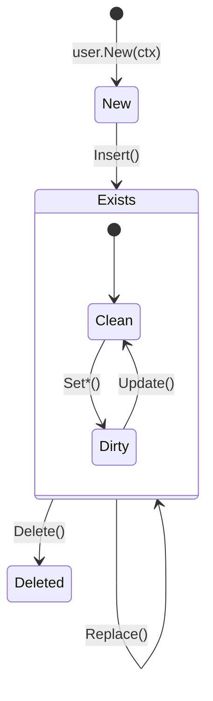

# CRUD операции

Обзор операций создания, чтения, обновления и удаления записей.

## Создание объекта

### New

```go
u := user.New(ctx)
```

Создаёт новый объект в памяти. Объект **не сохранён** в БД:

```go
u.Exists    // false — объект не из БД
u.IsReplica // false
u.Readonly  // false
```

### Установка значений

```go
u.SetEmail("john@example.com")
u.SetName("John Doe")
u.SetCreatedAt(uint32(time.Now().Unix()))
```

!!! warning "Первичный ключ"
    Для полей с `init_by_db` (автоинкремент) не нужно вызывать сеттер — значение присвоит БД.

## Insert

Добавляет новую запись в БД:

```go
u := user.New(ctx)
u.SetEmail("john@example.com")
u.SetName("John Doe")

if err := u.Insert(ctx); err != nil {
    return fmt.Errorf("insert failed: %w", err)
}

// После Insert
u.Exists // true
fmt.Println("ID:", u.GetId())  // Автоинкремент заполнен
```

**Условия:**
- `Exists` должен быть `false` (объект создан через `New`)
- Не должно быть конфликта по уникальным ключам

**Ошибки:**
- Конфликт первичного ключа
- Конфликт уникального индекса
- Ошибка соединения

## Update

Обновляет **только изменённые** поля:

```go
u, _ := user.SelectById(ctx, 123)

u.SetName("New Name")
u.SetUpdatedAt(uint32(time.Now().Unix()))

if err := u.Update(ctx); err != nil {
    return err
}
```

**Условия:**
- `Exists` должен быть `true`
- Объект не должен быть `Readonly`

**Особенности:**
- Обновляются только поля, для которых вызывался `Set*`
- Мутаторы применяются атомарно
- Если `Repaired = true`, работает как `Replace`

!!! tip "Оптимизация"
    Update отправляет в БД только изменённые поля, экономя трафик.

## Replace

Перезаписывает **все** поля объекта:

```go
u, _ := user.SelectById(ctx, 123)

u.SetName("Updated Name")
// Все поля будут перезаписаны, даже неизменённые

if err := u.Replace(ctx); err != nil {
    return err
}
```

**Условия:**
- `Exists` должен быть `true`
- Объект не должен быть `Readonly`

**Когда использовать:**
- Полная синхронизация с внешним источником
- После восстановления данных (Repaired)

## InsertOrReplace

Атомарная операция: вставка или замена:

```go
u := user.New(ctx)
u.SetId(123)  // Может существовать или нет
u.SetEmail("john@example.com")
u.SetName("John Doe")

if err := u.InsertOrReplace(ctx); err != nil {
    return err
}
```

**Поведение:**
- Если запись с таким PK не существует — Insert
- Если существует — Replace (перезапись всех полей)

!!! warning "Конфликты"
    Конфликт по **не первичному** уникальному ключу вернёт ошибку.

## Delete

Удаляет запись из БД:

```go
u, _ := user.SelectById(ctx, 123)

if err := u.Delete(ctx); err != nil {
    return err
}

// После Delete
u.Exists // false
```

**Условия:**
- `Exists` должен быть `true`

## Жизненный цикл объекта



## Системные поля

Каждый объект содержит системные поля:

| Поле | Тип | Описание |
|------|-----|----------|
| `Exists` | bool | Объект получен из БД |
| `IsReplica` | bool | Объект получен из реплики |
| `Readonly` | bool | Запрещены модификации |
| `Repaired` | bool | Объект восстановлен триггером |
| `UpdateOps` | []Op | Список изменений |

```go
u, _ := user.SelectById(ctx, 123)

if u.IsReplica {
    // Получено из реплики — только чтение
}

if u.Readonly {
    u.SetName("...") // Ошибка!
}

if u.Repaired {
    // Данные были восстановлены триггером
    // Update() будет работать как Replace()
}
```

## Обработка ошибок

```go
import "errors"

u, err := user.SelectById(ctx, 123)
if err != nil {
    if errors.Is(err, activerecord.ErrNotFound) {
        return fmt.Errorf("user not found")
    }
    return fmt.Errorf("database error: %w", err)
}

if err := u.Update(ctx); err != nil {
    // Проверка на конкурентное изменение
    if errors.Is(err, activerecord.ErrConcurrentModification) {
        // Retry logic
    }
    return err
}
```

## Транзакции

!!! warning "Нет поддержки транзакций"
    go-activerecord работает в режиме **автокоммита**. Каждая операция (`Insert`, `Update`, `Delete`) — отдельный коммит. Подробнее о причинах и рекомендуемых подходах см. [Транзакции и автокоммит](../architecture/transactions.md).

## Best Practices

### 1. Проверяйте ошибки

```go
// ❌ Плохо
user.Insert(ctx)

// ✅ Хорошо
if err := user.Insert(ctx); err != nil {
    return fmt.Errorf("insert user: %w", err)
}
```

### 2. Используйте контекст с таймаутом

```go
ctx, cancel := context.WithTimeout(context.Background(), 5*time.Second)
defer cancel()

u, err := user.SelectById(ctx, 123)
```

### 3. Не изменяйте после Delete

```go
u.Delete(ctx)
u.SetName("...")  // ❌ Объект удалён
u.Update(ctx)     // Ошибка
```

### 4. Проверяйте Exists перед операциями

```go
u := user.New(ctx)
u.Update(ctx)  // ❌ Ошибка: Exists = false

u, _ := user.SelectById(ctx, 123)
u.Insert(ctx)  // ❌ Ошибка: Exists = true
```

## Следующие шаги

- [Селекторы](selectors.md) — поиск записей
- [Атомарные операции](atomic-ops.md) — мутаторы
